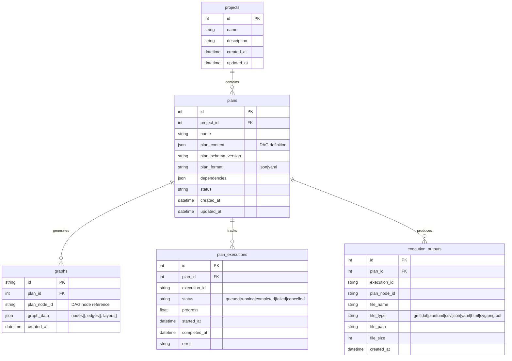

# Layercake Design Specification

## Summary

- Layercake is a tool for collecting graph data points, collecting them into a graph, allowing versioning and editing of the graph, and then exporting the full graph or selected subsets of the graph to various formats that can be configured multiple times, individually.
- Layercake is a single binary that can be used as a library, a CLI tool, or a web service. It is designed to be extensible and modular, allowing users to add their own data sources, exporters, and other components.
- Layercake started as a plan runner, where a YAML plan defines inputs (nodes, edges, layers in CSV format) and runs a pipeline execution for the plan, generating multiple outputs that are templated using handlebars (example: PlantUML output via feeding the graph data into a PlantUML handlebars template).
- Layercake is going to be running a server that can serve multiple projects, each with inputs, its own graph, transformations for outputs, and configured exporters, using the current plan runner as a base
- Data will be persisted in a sqlite database via seaorm (with PostgreSQL support for production)
- The server will expose a full set of tools for all operations via a MCP API for AI Agent and LLM interactions
- The server will also expose a REST API for web applications and other clients to interact with the data
- The server will also expose a GraphQL API for advanced querying and manipulation of the project, plan and graph data
- MCP, GraphQL and REST will all use a unified backend
- The project will remain a single binary, with the CLI tool and web service being two different modes of operation
- CLI one-off plan execution can be performed using the same data model, possibly with an in-memory SQL database and a default project initialized specifically for the run and then discarded
- Outputs will be written to a directory structure that can be configured per project, with the ability to override the output directory for one-off runs
- As a new capability, outputs will also be exposed directly as inputs to web components and other clients, allowing for dynamic updates and interactions (example: a react component rendering the graph and updating as the graph changes)
- Layercake will have a react frontend that can be used to interact with the server, allowing users to view and edit their projects, plans, and graphs as well as preview outputs and interact with the outputs dynamically

## API Architecture and Migration Strategy

### **Current Architecture Issues**

The current system has a single graph endpoint per project (`/api/v1/project/1/graph`) which doesn't support the hierarchical navigation required for project → plan → workflow → plan node inspection.

### **Target Architecture**

The target architecture supports three API interfaces with a unified backend that exposes **all functionality** through both GraphQL and MCP:

1. **GraphQL API** (Primary for frontend) - Complete CRUD operations, real-time subscriptions
2. **REST API** (Resource access and external integrations) - Lightweight access layer
3. **MCP API** (AI Agent interactions) - Complete functionality mirror of GraphQL

### **Unified Backend Principle**

**All core functionality must be accessible through both GraphQL and MCP APIs:**
- **Project Management**: Create, read, update, delete projects
- **Plan Management**: CRUD operations, validation, execution control
- **Graph Operations**: Data inspection, transformation, export
- **Execution Monitoring**: Status tracking, logging, output management
- **Real-time Updates**: Subscription-based live updates (GraphQL) and polling (MCP)

**No business logic in API layers** - all operations go through shared service layer.

### **Migration Path**

**Phase 1: Foundation (Current → Hybrid)**
- **Timeline**: 2-4 weeks
- **Goal**: Introduce GraphQL alongside existing REST
- **Actions**:
  - Implement GraphQL schema with hierarchical navigation support
  - Keep existing REST endpoints for backward compatibility
  - Add flat REST endpoints for direct resource access
  - Implement unified backend layer serving both REST and GraphQL

**Phase 2: Frontend Migration (Hybrid → GraphQL-first)**
- **Timeline**: 4-6 weeks
- **Goal**: Migrate frontend components to GraphQL
- **Actions**:
  - Update GraphVisualization component to support hierarchical context
  - Implement hierarchical navigation components (ProjectOverview → PlanSelector → WorkflowViewer)
  - Add real-time subscriptions for live execution monitoring
  - Maintain REST fallbacks for non-critical features

**Phase 3: Feature Expansion (GraphQL-first → Full Feature)**
- **Timeline**: 6-8 weeks
- **Goal**: Complete feature set with graph inspection
- **Actions**:
  - Implement graph inspection at every DAG plan node
  - Add MCP API for AI agent interactions
  - Implement advanced caching strategies
  - Add performance optimizations for large graphs

**Phase 4: Deprecation (Full Feature → Clean Architecture)**
- **Timeline**: 2-3 weeks
- **Goal**: Clean up legacy endpoints
- **Actions**:
  - Deprecate hierarchical REST endpoints
  - Keep minimal flat REST for simple integrations
  - Document final API surface
  - Optimize performance based on usage patterns

### **API Endpoint Design Comparison**

**Hierarchical REST Endpoints (Phase 1-2):**
```
GET /api/v1/project/{project_id}                                    # Project metadata
GET /api/v1/project/{project_id}/plans                             # All plans in project
GET /api/v1/project/{project_id}/plan/{plan_id}                    # Specific plan DAG
GET /api/v1/project/{project_id}/plan/{plan_id}/executions         # Plan executions
GET /api/v1/project/{project_id}/plan/{plan_id}/execution/{execution_id}  # Execution state
GET /api/v1/project/{project_id}/plan/{plan_id}/plan-node/{plan_node_id}/graph      # Graph at plan node
```

**Flat REST Endpoints (Phase 3-4):**
```
GET /api/v1/projects                           # List all projects
GET /api/v1/projects/{project_id}              # Single project
GET /api/v1/plans/{plan_id}                    # Single plan
GET /api/v1/executions/{execution_id}          # Single execution
GET /api/v1/graphs/{graph_id}                  # Single graph object
GET /api/v1/plan-nodes/{plan_node_id}/graph              # Graph at specific plan node
```

**GraphQL Endpoint (All Phases):**
```
POST /graphql                                  # Single endpoint for all queries
WS   /graphql                                  # WebSocket for subscriptions
```

**Advantages of Hybrid Approach:**
- **Semantic clarity**: Hierarchical URLs for human-readable resource relationships
- **Direct access**: Flat URLs for efficient resource access
- **Flexibility**: GraphQL for complex queries and real-time updates
- **Migration safety**: Gradual transition with backward compatibility

## Plan Data, Presentation and Editing Format

### **DAG-Based Plan Structure**

Plans represent execution workflows as Directed Acyclic Graphs (DAGs) that can branch and have multiple endpoints, moving beyond simple linear pipelines.

#### **Plan Data Format Strategy**
- **Internal Representation**: JSON with flat DAG structure (nodes[] + edges[])
- **Legacy Support**: YAML import/conversion (read-only)
- **Primary Interface**: Visual DAG editor with direct JSON import/export
- **Collaboration**: JSON Patch operations for real-time editing
- **Query Support**: GraphQL-friendly flat structure with strong typing

#### **Flat DAG Plan Schema**

```json
{
  "version": "2.0",
  "metadata": {
    "name": "Architecture Analysis Plan", 
    "description": "Multi-branch execution with parallel exports",
    "created_at": "2025-01-15T10:30:00Z",
    "schema_version": "2.0.0"
  },
  "dag": {
    "nodes": [
      {
        "id": "import_data",
        "type": "import",
        "label": "Import Graph Data",
        "config": {
          "imports": [
            {
              "id": "arch_csv",
              "type": "csv_files",
              "sources": {
                "nodes": "architecture/nodes.csv",
                "edges": "architecture/edges.csv", 
                "layers": "architecture/layers.csv"
              }
            }
          ],
          "merge_strategy": "append"
        },
        "render_context": {
          "graph_name": "Architecture Overview",
          "theme": "corporate",
          "base_layout": "hierarchical"
        },
        "position": { "x": 100, "y": 100 }
      },
      {
        "id": "filter_active",
        "type": "transform",
        "label": "Filter Active Components",
        "config": {
          "operation": "filter",
          "rules": {
            "nodes": "status == 'active'",
            "edges": "weight > 0.3"
          }
        },
        "render_context": {
          "graph_name": "Active Components"
        },
        "position": { "x": 300, "y": 100 }
      },
      {
        "id": "export_plantuml",
        "type": "export",
        "label": "Export PlantUML",
        "config": {
          "format": "plantuml",
          "output": "diagrams/components.puml"
        },
        "render_context": {
          "plantuml": {
            "skin": "corporate",
            "direction": "top to bottom"
          }
        },
        "position": { "x": 400, "y": 250 }
      }
    ],
    "edges": [
      {
        "id": "import_to_filter",
        "source": "import_data",
        "target": "filter_active",
        "type": "data_flow"
      },
      {
        "id": "filter_to_plantuml",
        "source": "filter_active", 
        "target": "export_plantuml",
        "type": "data_flow"
      }
    ]
  }
}
```

### **Execution Model**

#### **Node Types**
- **IMPORT**: Entry points that load graph data from external sources
- **TRANSFORM**: Operations that modify graph data (filter, group, aggregate, etc.)
- **EXPORT**: Terminal nodes that generate output files/content

#### **Execution Flow**
- **Parallel Execution**: Independent branches can execute concurrently
- **Multiple Endpoints**: Fan-out to different export formats
- **Render Context Flow**: Metadata accumulates along execution paths

#### **DAG Validation Rules**
- No cycles allowed in the execution graph
- Import nodes must have no incoming edges
- Export nodes must have no outgoing edges  
- Transform nodes must have both incoming and outgoing edges
- All nodes must be reachable from at least one import node

### **Import Node Configuration**

Import nodes support multiple data sources that can be combined into a single graph scope:

**Import Types:**
- `csv_files`: CSV files from filesystem (nodes.csv, edges.csv, layers.csv)
- `csv_upload`: Uploaded CSV files via web interface
- `gml_file`: GML (Graph Modeling Language) file from filesystem
- `gml_upload`: Uploaded GML file via web interface
- `http_endpoint`: Dynamic data from HTTP/REST API
- `database_query`: Direct database query results

**Merge Strategies:**
- `append`: Add all imported data to existing graph
- `merge`: Smart merge based on node/edge IDs (updates existing, adds new)
- `replace`: Replace entire graph with imported data
- `union`: Combine graphs with conflict resolution

**Example Configuration:**
```json
{
  "imports": [
    {
      "id": "base_architecture",
      "type": "csv_files",
      "sources": {
        "nodes": "data/nodes.csv",
        "edges": "data/edges.csv",
        "layers": "data/layers.csv"
      }
    },
    {
      "id": "service_registry",
      "type": "http_endpoint",
      "sources": {
        "url": "https://api.company.com/services/graph",
        "method": "GET",
        "headers": {
          "Authorization": "Bearer ${SERVICE_TOKEN}"
        },
        "format": "json"
      }
    }
  ],
  "merge_strategy": "merge",
  "conflict_resolution": "keep_last"
}
```

### **Export Node Configuration**

**Built-in Exporters (no template parameter):**
- `plantuml`: Uses internal PlantUML generation logic
- `mermaid`: Uses internal Mermaid generation logic  
- `dot`: Uses internal DOT/Graphviz generation logic
- `json`: Uses internal JSON serialization
- `csv`: Uses internal CSV export for nodes/edges/layers

**Custom Exporter (requires template parameter):**
- `custom`: Uses user-provided Handlebars template
- Receives full graph context + resolved render context

```json
{
  "format": "custom",
  "template": "reports/analysis.html.hbs",
  "output": "reports/analysis.html"
}
```

## Hierarchical Navigation and Graph Inspection

### **Navigation Hierarchy**

The system supports hierarchical navigation from project level down to individual graph inspection:

```
Project → Plan → Workflow (DAG) → Node Inspection → Graph Visualization
```

### **GraphQL Schema**

```graphql
type Project {
  id: ID!
  name: String!
  description: String
  plans: [Plan!]!
  activeExecutions: [ExecutionState!]!
  createdAt: DateTime!
  updatedAt: DateTime!
}

type Plan {
  id: ID!
  project: Project!
  name: String!
  dag: ExecutionDAG!
  executions: [ExecutionState!]!
  # Get graph at any plan node in the DAG
  graphAtPlanNode(planNodeId: ID!, executionId: ID): GraphObject
  # Get all inspectable points in the plan
  inspectionPoints(executionId: ID): [GraphInspectionPoint!]!
}

type ExecutionState {
  id: ID!
  plan: Plan!
  status: ExecutionStatus!
  graphObjects: [GraphObject!]!
  planNodeScopes: [GraphScope!]!
  currentPlanNode: ID
  # Get all available graphs for inspection
  inspectableGraphs: [GraphInspectionPoint!]!
  # Navigation breadcrumbs
  executionPath: [ExecutionPathPlanNode!]!
}

type GraphInspectionPoint {
  planNodeId: ID!
  planNodeName: String!
  planNodeType: PlanNodeType!
  graphRef: ID!
  graphObject: GraphObject!
  renderContext: JSON!
  canInspect: Boolean!
  executionStatus: PlanNodeExecutionStatus!
  lastUpdated: DateTime
}

type ExecutionPathPlanNode {
  planNodeId: ID!
  planNodeName: String!
  status: PlanNodeExecutionStatus!
  startedAt: DateTime
  completedAt: DateTime
  graphRef: ID
}

type GraphScope {
  id: ID!
  planNodeId: ID!
  graphRef: ID!
  renderContext: JSON!
}

enum PlanNodeType {
  IMPORT
  TRANSFORM
  EXPORT
}

enum PlanNodeExecutionStatus {
  PENDING
  RUNNING
  COMPLETED
  FAILED
  SKIPPED
}
```

### **GraphQL Queries for Hierarchical Navigation**

**Project Overview:**
```graphql
query GetProject($projectId: ID!) {
  project(id: $projectId) {
    id
    name
    description
    plans {
      id
      name
      dag {
        nodes {
          id
          type
          label
        }
      }
      activeExecutions: executions(status: [RUNNING, PENDING]) {
        id
        status
        currentPlanNode
        startedAt
      }
    }
  }
}
```

**Graph at Specific Plan Node:**
```graphql
query GetGraphAtPlanNode($projectId: ID!, $planId: ID!, $planNodeId: ID!, $executionId: ID) {
  project(id: $projectId) {
    plan(id: $planId) {
      graphAtPlanNode(planNodeId: $planNodeId, executionId: $executionId) {
        id
        hash
        createdByPlanNode
        nodes {
          id
          label
          layer
          x
          y
          weight
        }
        edges {
          id
          source
          target
          weight
          layer
        }
        layers {
          id
          name
          color
          description
        }
        metadata {
          nodeCount
          edgeCount
          layerCount
          transformation
          createdAt
        }
      }
    }
  }
}
```

### **Live Execution Monitoring**

**Real-time Updates via GraphQL Subscriptions:**
```typescript
subscription ExecutionUpdates($executionId: ID!) {
  executionStateChanged(executionId: $executionId) {
    id
    status
    currentPlanNode
    planNodeScopes {
      planNodeId
      graphRef
      renderContext
    }
    errors {
      planNodeId
      message
      timestamp
    }
  }
}
```

### **Graph Inspection Specifications**

**Inspection Points Definition:**
1. **Import Nodes**: Always inspectable - show imported graph data
2. **Transform Nodes**: Inspectable after execution - show transformed graph
3. **Export Nodes**: Inspectable during/after execution - show final graph used for export
4. **Failed Nodes**: Always inspectable - show input graph for debugging

**Inspection Capabilities:**
```typescript
interface GraphInspectionCapabilities {
  // What can be inspected
  canViewGraph: boolean;          // Graph visualization available
  canViewMetadata: boolean;       // Graph metadata available
  canViewRenderContext: boolean;  // Render context available
  canViewTransformations: boolean; // Applied transformations
  canViewErrors: boolean;         // Error information if failed
  
  // Interactive capabilities
  canEditGraph: boolean;          // Graph data can be modified
  canReExecute: boolean;          // Node can be re-executed
  canExportGraph: boolean;        // Graph can be exported separately
  
  // Data availability
  graphDataSize: number;          // Size of graph data
  lastUpdated: DateTime;          // When graph was last updated
  cacheStatus: 'fresh' | 'stale' | 'loading';
}
```

## Frontend Architecture

### **Component Hierarchy**

```typescript
// Navigation hierarchy
ProjectOverview -> PlanSelector -> WorkflowViewer -> GraphVisualization
                                     ↓                ↓
                                PlanNodeInspector -> GraphDataGrid
                                     ↓
                                GraphVisualization
```

### **Updated GraphVisualization Component**

```typescript
interface GraphVisualizationProps {
  // Current props
  nodes: GraphNode[];
  edges: GraphEdge[];
  layers: GraphLayer[];
  
  // New props for hierarchical context
  context: 'project' | 'plan' | 'workflow' | 'plan-node-inspection';
  dataSource: {
    type: 'rest' | 'graphql';
    endpoint?: string;
    query?: string;
    variables?: Record<string, any>;
  };
  
  // Navigation context
  projectId: string;
  planId?: string;
  planNodeId?: string;
  executionId?: string;
  
  // Inspection capabilities
  enablePlanNodeInspection?: boolean;
  onPlanNodeInspect?: (planNodeId: string) => void;
  
  // DAG-specific props
  showExecutionPath?: boolean;
  highlightActiveNodes?: boolean;
  executionState?: ExecutionState;
  
  // Navigation callbacks
  onNavigateToProject?: () => void;
  onNavigateToPlan?: () => void;
  onNavigateToPlanNode?: (planNodeId: string) => void;
}
```

### **GraphDataGrid Component**

The GraphDataGrid provides a spreadsheet-like interface for viewing and editing graph data (nodes, edges, layers) at any point in the execution DAG.

```typescript
interface GraphDataGridProps {
  // Data source
  graphObject: GraphObject;
  
  // Context
  projectId: string;
  planId: string;
  planNodeId: string;
  executionId?: string;
  
  // Edit configuration
  editMode: 'transformation' | 'in-place' | 'read-only';
  allowedOperations: {
    addNodes: boolean;
    editNodes: boolean;
    deleteNodes: boolean;
    addEdges: boolean;
    editEdges: boolean;
    deleteEdges: boolean;
    addLayers: boolean;
    editLayers: boolean;
    deleteLayers: boolean;
  };
  
  // Grid configuration
  defaultTab: 'nodes' | 'edges' | 'layers';
  enableVirtualization: boolean;
  pageSize?: number;
  
  // Callbacks
  onDataChange: (changes: GraphDataChanges) => void;
  onValidationError: (errors: ValidationError[]) => void;
  onCommitChanges: (strategy: EditStrategy) => void;
  onDiscardChanges: () => void;
  
  // Integration
  syncWithVisualization: boolean;
  onNodeSelect: (nodeIds: string[]) => void;
  onEdgeSelect: (edgeIds: string[]) => void;
}

interface GraphDataChanges {
  nodes: {
    added: GraphNode[];
    updated: { id: string; changes: Partial<GraphNode> }[];
    deleted: string[];
  };
  edges: {
    added: GraphEdge[];
    updated: { id: string; changes: Partial<GraphEdge> }[];
    deleted: string[];
  };
  layers: {
    added: GraphLayer[];
    updated: { id: string; changes: Partial<GraphLayer> }[];
    deleted: string[];
  };
}

enum EditStrategy {
  TRANSFORMATION_NODE = 'transformation',
  IN_PLACE_UPDATE = 'in-place',
  DRAFT_CHANGES = 'draft'
}
```

### **Edit Handling Strategies**

#### **1. Transformation Node Strategy (Recommended)**

**Approach**: Create a new transformation plan node that applies the edits as a formal transformation operation.

**Benefits:**
- **Audit Trail**: Complete history of all changes with timestamps and user info
- **Reversibility**: Can easily undo/redo changes by modifying the DAG
- **Consistency**: Follows the established DAG execution model
- **Collaboration**: Multiple users can see pending changes as DAG nodes
- **Validation**: Transformations can be validated before execution
- **Performance**: Efficient caching and incremental execution

**Implementation:**
```json
{
  "id": "edit_transform_{{timestamp}}",
  "type": "transform",
  "label": "Manual Edits - {{datetime}}",
  "config": {
    "operation": "manual_edit",
    "changes": {
      "nodes": {
        "added": [...],
        "updated": [...],
        "deleted": [...]
      },
      "edges": {
        "added": [...],
        "updated": [...],
        "deleted": [...]
      },
      "layers": {
        "added": [...],
        "updated": [...],
        "deleted": [...]
      }
    },
    "metadata": {
      "edited_by": "user_id",
      "edited_at": "2025-01-15T10:30:00Z",
      "edit_source": "data_grid",
      "validation_status": "passed"
    }
  },
  "render_context": {
    "edit_summary": "Added 5 nodes, updated 3 edges, deleted 1 layer"
  }
}
```

**GraphQL Mutations:**
```graphql
mutation CreateEditTransformation($planId: ID!, $planNodeId: ID!, $changes: GraphDataChanges!) {
  createEditTransformation(
    planId: $planId
    afterPlanNode: $planNodeId
    changes: $changes
  ) {
    id
    label
    config
    validationErrors {
      type
      message
      affectedElements
    }
  }
}

mutation ExecuteEditTransformation($planId: ID!, $transformationId: ID!) {
  executeEditTransformation(planId: $planId, transformationId: $transformationId) {
    executionId
    status
    resultingGraphId
  }
}
```

#### **2. In-Place Update Strategy**

**Approach**: Directly modify the graph object and create a new version.

**Benefits:**
- **Simplicity**: Direct updates without DAG complexity
- **Speed**: Immediate changes without execution overhead
- **Familiar UX**: Traditional spreadsheet editing experience

**Drawbacks:**
- **Limited Audit Trail**: Only version history, not operation history
- **Harder Collaboration**: Concurrent edits are more complex
- **Validation Complexity**: Need to validate entire graph state
- **Cache Invalidation**: Requires careful cache management

**Implementation:**
```graphql
mutation UpdateGraphObject($graphId: ID!, $changes: GraphDataChanges!) {
  updateGraphObject(graphId: $graphId, changes: $changes) {
    newGraphObject {
      id
      hash
      nodes { id, label, layer }
      edges { id, source, target }
      layers { id, name, color }
    }
    validationErrors {
      type
      message
      affectedElements
    }
    changesSummary {
      nodesAdded
      nodesUpdated
      nodesDeleted
      edgesAdded
      edgesUpdated
      edgesDeleted
    }
  }
}
```

#### **3. Draft Changes Strategy (Hybrid)**

**Approach**: Buffer changes locally and allow users to choose application strategy.

**Benefits:**
- **Flexibility**: Users can preview changes before committing
- **Safety**: No immediate impact on execution state
- **Choice**: Can choose between transformation or in-place on commit

**Implementation:**
```typescript
interface DraftChanges {
  id: string;
  planNodeId: string;
  changes: GraphDataChanges;
  createdAt: DateTime;
  lastModified: DateTime;
  
  // Preview capabilities
  previewGraph: GraphObject;
  validationStatus: 'pending' | 'valid' | 'invalid';
  validationErrors: ValidationError[];
  
  // Commit options
  availableStrategies: EditStrategy[];
  recommendedStrategy: EditStrategy;
}

// Local state management
const useDraftChanges = (planNodeId: string) => {
  const [draftChanges, setDraftChanges] = useState<DraftChanges | null>(null);
  
  const commitChanges = async (strategy: EditStrategy) => {
    switch (strategy) {
      case EditStrategy.TRANSFORMATION_NODE:
        return await createEditTransformation(draftChanges);
      case EditStrategy.IN_PLACE_UPDATE:
        return await updateGraphObject(draftChanges);
    }
  };
  
  return { draftChanges, setDraftChanges, commitChanges };
};
```

### **Recommended Approach**

**Primary**: **Transformation Node Strategy** for the following reasons:

1. **Consistency with Architecture**: Aligns with the DAG-based execution model
2. **Auditability**: Full change history with operational semantics
3. **Collaboration**: Clear visibility of pending changes in the DAG
4. **Rollback Capability**: Can easily undo changes by removing transformation nodes
5. **Validation Integration**: Changes are validated as part of plan execution
6. **Performance**: Leverages existing caching and execution infrastructure

**Secondary**: **Draft Changes Strategy** for user experience:
- Allow users to make multiple edits before committing
- Provide real-time validation feedback
- Show preview of changes before applying
- Offer choice between transformation and in-place on commit

**Implementation Priority:**
1. **Phase 1**: Transformation node strategy with basic data grid
2. **Phase 2**: Draft changes with preview capabilities
3. **Phase 3**: Advanced features (bulk operations, import/export, templates)

### **Data Grid Technical Specifications**

**Grid Library**: Recommend **AG-Grid** or **TanStack Table** for:
- High performance virtualization (10,000+ rows)
- Excel-like editing experience
- Built-in validation and data types
- Customizable column definitions
- Copy/paste from Excel
- Undo/redo functionality

**Column Definitions:**

**Nodes Tab:**
```typescript
const nodeColumns = [
  { field: 'id', headerName: 'ID', editable: false, pinned: 'left' },
  { field: 'label', headerName: 'Label', editable: true, required: true },
  { field: 'layer', headerName: 'Layer', editable: true, cellEditor: 'layerSelect' },
  { field: 'x', headerName: 'X Position', editable: true, type: 'number' },
  { field: 'y', headerName: 'Y Position', editable: true, type: 'number' },
  { field: 'weight', headerName: 'Weight', editable: true, type: 'number' },
  { field: 'comment', headerName: 'Comment', editable: true, type: 'text' },
  { field: 'metadata', headerName: 'Metadata', editable: true, type: 'json' }
];
```

**Edges Tab:**
```typescript
const edgeColumns = [
  { field: 'id', headerName: 'ID', editable: false, pinned: 'left' },
  { field: 'source', headerName: 'Source Node', editable: true, cellEditor: 'nodeSelect' },
  { field: 'target', headerName: 'Target Node', editable: true, cellEditor: 'nodeSelect' },
  { field: 'label', headerName: 'Label', editable: true },
  { field: 'layer', headerName: 'Layer', editable: true, cellEditor: 'layerSelect' },
  { field: 'weight', headerName: 'Weight', editable: true, type: 'number' },
  { field: 'comment', headerName: 'Comment', editable: true, type: 'text' }
];
```

**Layers Tab:**
```typescript
const layerColumns = [
  { field: 'id', headerName: 'ID', editable: false, pinned: 'left' },
  { field: 'name', headerName: 'Name', editable: true, required: true },
  { field: 'color', headerName: 'Color', editable: true, cellEditor: 'colorPicker' },
  { field: 'description', headerName: 'Description', editable: true },
  { field: 'visible', headerName: 'Visible', editable: true, type: 'boolean' },
  { field: 'order', headerName: 'Display Order', editable: true, type: 'number' }
];
```

**Validation Rules:**
```typescript
const validationRules = {
  nodes: {
    id: { required: true, unique: true, pattern: /^[a-zA-Z0-9_-]+$/ },
    label: { required: true, maxLength: 100 },
    layer: { required: true, mustExistInLayers: true },
    x: { type: 'number', min: 0 },
    y: { type: 'number', min: 0 },
    weight: { type: 'number', min: 0 }
  },
  edges: {
    id: { required: true, unique: true },
    source: { required: true, mustExistInNodes: true },
    target: { required: true, mustExistInNodes: true, notEqual: 'source' },
    layer: { mustExistInLayers: true },
    weight: { type: 'number', min: 0 }
  },
  layers: {
    id: { required: true, unique: true, pattern: /^[a-zA-Z0-9_-]+$/ },
    name: { required: true, maxLength: 50 },
    color: { required: true, pattern: /^#[0-9A-Fa-f]{6}$/ }
  }
};
```

### **Integration with Graph Visualization**

**Bidirectional Sync:**
```typescript
interface GraphVisualizationSync {
  // Data grid changes update visualization
  onDataGridChange: (changes: GraphDataChanges) => void;
  
  // Visualization selections update data grid
  onVisualizationSelect: (selection: { nodes: string[], edges: string[] }) => void;
  
  // Highlight corresponding elements
  highlightInVisualization: (ids: string[], type: 'nodes' | 'edges') => void;
  highlightInDataGrid: (ids: string[], type: 'nodes' | 'edges') => void;
  
  // Sync viewport and focus
  focusOnElement: (id: string, type: 'node' | 'edge') => void;
}
```

## Real-Time Collaborative Editing

### **Multi-Browser Synchronization Architecture**

The system supports real-time collaborative editing across multiple browser sessions using GraphQL subscriptions and React live updating, enabling teams to work together on graph data simultaneously.

### **Collaboration Model**

#### **1. Operational Transformation for Conflict Resolution**

**Approach**: Use Operational Transformation (OT) principles adapted for graph data structures.

```typescript
interface GraphOperation {
  id: string;
  type: 'add_node' | 'update_node' | 'delete_node' | 'add_edge' | 'update_edge' | 'delete_edge' | 'add_layer' | 'update_layer' | 'delete_layer';
  planNodeId: string;
  elementId: string;
  data: any;
  userId: string;
  timestamp: DateTime;
  clientId: string;
  sequenceNumber: number;
}

interface GraphOperationResult {
  operation: GraphOperation;
  transformedOperation?: GraphOperation;
  conflict?: ConflictResolution;
  applied: boolean;
}

enum ConflictResolution {
  MERGE = 'merge',           // Combine changes intelligently
  LAST_WRITE_WINS = 'lww',  // Most recent change wins
  USER_RESOLVE = 'manual',   // Require manual conflict resolution
  FIRST_WRITE_WINS = 'fww'  // First change wins, reject later changes
}
```

#### **2. GraphQL Subscription Schema**

```graphql
# Real-time subscriptions for collaborative editing
subscription GraphDataChanges($planNodeId: ID!, $userId: ID!) {
  graphDataChanged(planNodeId: $planNodeId, excludeUser: $userId) {
    operation {
      id
      type
      planNodeId
      elementId
      data
      userId
      timestamp
      clientId
      sequenceNumber
    }
    conflict {
      type
      description
      conflictingOperations {
        id
        userId
        timestamp
      }
    }
    resultingChange {
      nodes {
        added { id, label, layer, x, y }
        updated { id, changes }
        deleted
      }
      edges {
        added { id, source, target, label }
        updated { id, changes }
        deleted
      }
      layers {
        added { id, name, color }
        updated { id, changes }
        deleted
      }
    }
  }
}

# User presence tracking
subscription UserPresence($planNodeId: ID!) {
  userPresenceChanged(planNodeId: $planNodeId) {
    userId
    userName
    status: ONLINE | OFFLINE | EDITING
    currentElement {
      type: 'node' | 'edge' | 'layer'
      id: string
    }
    cursorPosition {
      x: number
      y: number
    }
    lastActivity: DateTime
  }
}

# Draft changes sharing
subscription DraftChanges($planNodeId: ID!, $userId: ID!) {
  draftChangesShared(planNodeId: $planNodeId, excludeUser: $userId) {
    userId
    userName
    draftId
    changes {
      nodes { added, updated, deleted }
      edges { added, updated, deleted }
      layers { added, updated, deleted }
    }
    previewEnabled: boolean
    expiresAt: DateTime
  }
}
```

#### **3. React Live Updating Implementation**

**Collaborative Data Grid Hook:**
```typescript
interface CollaborativeEditingState {
  // Current editing state
  localChanges: GraphDataChanges;
  remoteChanges: GraphDataChanges[];
  conflictedChanges: ConflictedChange[];
  
  // User presence
  activeUsers: CollaborativeUser[];
  userCursors: Record<string, CursorPosition>;
  
  // Draft sharing
  sharedDrafts: Record<string, DraftChanges>;
  
  // Synchronization
  isConnected: boolean;
  lastSyncTimestamp: DateTime;
  pendingOperations: GraphOperation[];
}

interface CollaborativeUser {
  id: string;
  name: string;
  color: string;
  status: 'online' | 'offline' | 'editing';
  currentElement?: { type: 'node' | 'edge' | 'layer'; id: string };
  lastActivity: DateTime;
}

interface CursorPosition {
  userId: string;
  x: number;
  y: number;
  elementId?: string;
  elementType?: 'node' | 'edge' | 'layer';
}

const useCollaborativeEditing = (planNodeId: string) => {
  const [state, setState] = useState<CollaborativeEditingState>({
    localChanges: { nodes: { added: [], updated: [], deleted: [] }, edges: { added: [], updated: [], deleted: [] }, layers: { added: [], updated: [], deleted: [] } },
    remoteChanges: [],
    conflictedChanges: [],
    activeUsers: [],
    userCursors: {},
    sharedDrafts: {},
    isConnected: false,
    lastSyncTimestamp: new Date(),
    pendingOperations: []
  });

  // Subscribe to real-time changes
  const { data: changeData } = useSubscription(GRAPH_DATA_CHANGES_SUBSCRIPTION, {
    variables: { planNodeId, userId: currentUser.id }
  });

  // Subscribe to user presence
  const { data: presenceData } = useSubscription(USER_PRESENCE_SUBSCRIPTION, {
    variables: { planNodeId }
  });

  // Subscribe to draft changes
  const { data: draftData } = useSubscription(DRAFT_CHANGES_SUBSCRIPTION, {
    variables: { planNodeId, userId: currentUser.id }
  });

  // Apply remote changes with conflict resolution
  const applyRemoteChange = useCallback((operation: GraphOperation) => {
    setState(prev => {
      const transformedOp = transformOperation(operation, prev.localChanges);
      const newState = applyOperation(prev, transformedOp);
      
      if (transformedOp.conflict) {
        newState.conflictedChanges.push({
          localOperation: prev.pendingOperations.find(op => op.elementId === operation.elementId),
          remoteOperation: operation,
          resolution: transformedOp.conflict
        });
      }
      
      return newState;
    });
  }, []);

  // Send local changes to server
  const sendLocalChange = useCallback(async (operation: GraphOperation) => {
    setState(prev => ({
      ...prev,
      pendingOperations: [...prev.pendingOperations, operation]
    }));

    try {
      await sendGraphOperation({ variables: { operation } });
    } catch (error) {
      // Handle network errors, retry logic
      setState(prev => ({
        ...prev,
        pendingOperations: prev.pendingOperations.filter(op => op.id !== operation.id)
      }));
    }
  }, []);

  return {
    state,
    sendLocalChange,
    resolveConflict: (conflictId: string, resolution: ConflictResolution) => {
      // Implement conflict resolution logic
    },
    updateUserPresence: (elementId?: string, elementType?: string) => {
      // Update current user's presence
    }
  };
};
```

**Collaborative GraphDataGrid Component:**
```typescript
const CollaborativeGraphDataGrid: React.FC<GraphDataGridProps> = (props) => {
  const { state, sendLocalChange, resolveConflict, updateUserPresence } = useCollaborativeEditing(props.planNodeId);
  const [gridApi, setGridApi] = useState<GridApi | null>(null);

  // Apply remote changes to grid
  useEffect(() => {
    if (gridApi && state.remoteChanges.length > 0) {
      state.remoteChanges.forEach(change => {
        // Apply changes to AG-Grid
        const transaction: RowDataTransaction = {
          add: change.nodes.added,
          update: change.nodes.updated.map(u => ({ ...u.changes, id: u.id })),
          remove: change.nodes.deleted.map(id => ({ id }))
        };
        gridApi.applyTransaction(transaction);
      });
    }
  }, [gridApi, state.remoteChanges]);

  // Show user cursors and presence
  const renderUserPresence = () => (
    <div className="collaborative-presence">
      {state.activeUsers.map(user => (
        <div key={user.id} className="user-indicator" style={{ borderColor: user.color }}>
          <span className="user-name">{user.name}</span>
          {user.status === 'editing' && user.currentElement && (
            <span className="editing-indicator">
              Editing {user.currentElement.type} {user.currentElement.id}
            </span>
          )}
        </div>
      ))}
    </div>
  );

  // Handle local edits
  const onCellValueChanged = useCallback((params: CellValueChangedEvent) => {
    const operation: GraphOperation = {
      id: generateId(),
      type: 'update_node',
      planNodeId: props.planNodeId,
      elementId: params.data.id,
      data: { [params.colDef.field!]: params.newValue },
      userId: currentUser.id,
      timestamp: new Date(),
      clientId: clientId,
      sequenceNumber: getNextSequenceNumber()
    };
    
    sendLocalChange(operation);
    updateUserPresence(params.data.id, 'node');
  }, [props.planNodeId, sendLocalChange, updateUserPresence]);

  // Conflict resolution UI
  const renderConflictResolution = () => (
    <div className="conflict-resolution-panel">
      {state.conflictedChanges.map(conflict => (
        <ConflictResolutionDialog
          key={conflict.localOperation?.id}
          conflict={conflict}
          onResolve={(resolution) => resolveConflict(conflict.localOperation!.id, resolution)}
        />
      ))}
    </div>
  );

  return (
    <div className="collaborative-data-grid">
      {renderUserPresence()}
      <AGGridReact
        rowData={mergeChanges(props.graphObject, state.localChanges, state.remoteChanges)}
        onGridReady={(params) => setGridApi(params.api)}
        onCellValueChanged={onCellValueChanged}
        // ... other AG-Grid props
      />
      {renderConflictResolution()}
      <DraftChangesPanel sharedDrafts={state.sharedDrafts} />
    </div>
  );
};
```

#### **4. Operational Transformation Logic**

```typescript
const transformOperation = (remoteOp: GraphOperation, localChanges: GraphDataChanges): GraphOperationResult => {
  // Check for conflicts
  const hasConflict = checkForConflict(remoteOp, localChanges);
  
  if (!hasConflict) {
    return { operation: remoteOp, applied: true };
  }

  // Apply transformation rules based on operation types
  switch (remoteOp.type) {
    case 'update_node':
      return transformNodeUpdate(remoteOp, localChanges);
    case 'delete_node':
      return transformNodeDeletion(remoteOp, localChanges);
    case 'add_edge':
      return transformEdgeAddition(remoteOp, localChanges);
    // ... other transformation rules
  }
};

const transformNodeUpdate = (remoteOp: GraphOperation, localChanges: GraphDataChanges): GraphOperationResult => {
  const localUpdate = localChanges.nodes.updated.find(u => u.id === remoteOp.elementId);
  
  if (localUpdate) {
    // Both local and remote updated the same node
    const mergedData = mergeNodeData(localUpdate.changes, remoteOp.data);
    return {
      operation: { ...remoteOp, data: mergedData },
      conflict: ConflictResolution.MERGE,
      applied: true
    };
  }
  
  return { operation: remoteOp, applied: true };
};

const mergeNodeData = (localData: any, remoteData: any): any => {
  // Intelligent merging of node properties
  const merged = { ...localData };
  
  Object.keys(remoteData).forEach(key => {
    if (key === 'x' || key === 'y') {
      // For position changes, use most recent
      merged[key] = remoteData[key];
    } else if (key === 'label' && localData.label !== remoteData.label) {
      // For label conflicts, concatenate or ask user
      merged[key] = `${localData.label} | ${remoteData.label}`;
      merged._conflict = true;
    } else if (!localData.hasOwnProperty(key)) {
      // Add new properties
      merged[key] = remoteData[key];
    }
  });
  
  return merged;
};
```

#### **5. Conflict Resolution UI Components**

```typescript
interface ConflictResolutionDialogProps {
  conflict: ConflictedChange;
  onResolve: (resolution: ConflictResolution) => void;
}

const ConflictResolutionDialog: React.FC<ConflictResolutionDialogProps> = ({ conflict, onResolve }) => {
  return (
    <Dialog open={true} className="conflict-dialog">
      <DialogTitle>Editing Conflict Detected</DialogTitle>
      <DialogContent>
        <div className="conflict-details">
          <p>Both you and {conflict.remoteOperation.userId} edited the same element:</p>
          
          <div className="conflict-comparison">
            <div className="local-change">
              <h4>Your Changes:</h4>
              <pre>{JSON.stringify(conflict.localOperation?.data, null, 2)}</pre>
            </div>
            <div className="remote-change">
              <h4>Their Changes:</h4>
              <pre>{JSON.stringify(conflict.remoteOperation.data, null, 2)}</pre>
            </div>
          </div>
        </div>
      </DialogContent>
      <DialogActions>
        <Button onClick={() => onResolve(ConflictResolution.MERGE)}>
          Merge Changes
        </Button>
        <Button onClick={() => onResolve(ConflictResolution.LAST_WRITE_WINS)}>
          Use Their Version
        </Button>
        <Button onClick={() => onResolve(ConflictResolution.FIRST_WRITE_WINS)}>
          Keep My Version
        </Button>
        <Button onClick={() => onResolve(ConflictResolution.USER_RESOLVE)}>
          Resolve Manually
        </Button>
      </DialogActions>
    </Dialog>
  );
};

const DraftChangesPanel: React.FC<{ sharedDrafts: Record<string, DraftChanges> }> = ({ sharedDrafts }) => {
  return (
    <div className="draft-changes-panel">
      <h3>Shared Drafts</h3>
      {Object.values(sharedDrafts).map(draft => (
        <div key={draft.id} className="draft-item">
          <div className="draft-header">
            <span className="user-name">{draft.userId}</span>
            <span className="draft-summary">{generateDraftSummary(draft.changes)}</span>
          </div>
          {draft.previewEnabled && (
            <DraftPreview changes={draft.changes} />
          )}
        </div>
      ))}
    </div>
  );
};
```

#### **6. Performance Optimizations**

**Debounced Updates:**
```typescript
const useDebouncedCollaboration = (planNodeId: string, debounceMs = 300) => {
  const [pendingChanges, setPendingChanges] = useState<GraphOperation[]>([]);
  
  const debouncedSend = useMemo(
    () => debounce((operations: GraphOperation[]) => {
      // Batch operations for efficiency
      sendBatchOperations(operations);
      setPendingChanges([]);
    }, debounceMs),
    [debounceMs]
  );

  const queueOperation = useCallback((operation: GraphOperation) => {
    setPendingChanges(prev => [...prev, operation]);
    debouncedSend([...pendingChanges, operation]);
  }, [pendingChanges, debouncedSend]);

  return { queueOperation, pendingChanges };
};
```

**Selective Subscriptions:**
```typescript
const useSelectiveSubscription = (planNodeId: string, elementTypes: ('nodes' | 'edges' | 'layers')[]) => {
  return useSubscription(GRAPH_DATA_CHANGES_SUBSCRIPTION, {
    variables: { 
      planNodeId, 
      userId: currentUser.id,
      elementTypes // Only subscribe to relevant element types
    },
    shouldResubscribe: false // Prevent unnecessary resubscriptions
  });
};
```

### **Implementation Strategy**

#### **Phase 1: Basic Real-time Sync (2-3 weeks)**
1. Implement GraphQL subscriptions for graph data changes
2. Basic operational transformation for simple conflicts
3. Real-time updates in GraphDataGrid
4. User presence indicators

#### **Phase 2: Advanced Collaboration (3-4 weeks)**
1. Sophisticated conflict resolution UI
2. Draft changes sharing and preview
3. Operational transformation for complex scenarios
4. Performance optimizations (debouncing, batching)

#### **Phase 3: Production Features (2-3 weeks)**
1. Offline support with conflict resolution on reconnect
2. Change history and rollback capabilities
3. User permissions and edit locking
4. Collaborative transformation nodes (multiple users contributing to single transformation)

### **Collaboration Benefits**

1. **Real-time Awareness**: Users see each other's changes immediately
2. **Conflict Prevention**: Visual indicators of who is editing what
3. **Intelligent Merging**: Automatic conflict resolution where possible
4. **Audit Trail**: Complete history of who changed what and when
5. **Scalable Architecture**: Supports teams of any size working on complex graphs
6. **Consistent UX**: Same collaboration patterns across visualization and data grid

### **React Frontend Architecture**

- React frontend with TypeScript for type safety and modern development experience
- Modular component architecture with dynamic loading for large editors (ReactFlow, Isoflow)
- Component registry system enables pluggable editor components
- Development mode: separate React dev server with API proxy for hot reload
- Production mode: single binary serves embedded HTML shell loading CDN assets
- Frontend assets deployed to CDN (GitHub Pages/jsdelivr) via CI/CD for global distribution

### **URL Structure and Routing**

**Frontend Routes:**
```
/projects                                        # Project list
/projects/{project_id}                          # Project overview
/projects/{project_id}/plans                    # Plan list
/projects/{project_id}/plans/{plan_id}         # Plan DAG workflow
/projects/{project_id}/plans/{plan_id}/plan-nodes/{plan_node_id}  # Graph at plan node
/projects/{project_id}/plans/{plan_id}/executions/{execution_id}  # Live execution
/projects/{project_id}/plans/{plan_id}/executions/{execution_id}/plan-nodes/{plan_node_id}  # Graph at plan node in execution
```

## Data Editing Interfaces

- Multi-mode plan editor supporting three editing approaches:
  - Rich text YAML editor with syntax highlighting (legacy compatibility)
  - Visual ReactFlow editor for DAG-based plan construction
  - JSON patch editor for incremental real-time editing
- Spreadsheet-like interface for bulk data editing with tabs for layers, nodes, and edges
- Excel-like functionality including keyboard shortcuts, bulk operations, and data validation
- Real-time data synchronization across all editing interfaces via GraphQL subscriptions

## Graph Operations

- Graph versioning system with diff capabilities for tracking changes over time
- Advanced graph transformations and filtering for subset selection
- Connectivity analysis and path finding algorithms for graph insights
- Interactive graph visualization with drag-and-drop editing capabilities
- Performance optimization for large graphs (10,000+ nodes) with virtualization

### **Efficient Graph Object Management**

**Graph Object Storage:**
- Each transformation node creates a new unique graph object
- Graph objects are stored separately and referenced by ID
- Graph objects include hash for deduplication and caching
- Parent graph relationship tracked for lineage

**Benefits:**
- Eliminates graph data duplication in JSON structures
- Enables efficient caching and storage
- Supports graph object reuse across multiple export nodes
- Facilitates incremental execution with cached graph states

### **Caching Strategy**

```
- Project metadata: Cache for 5 minutes
- Plan DAG structure: Cache for 1 hour (invalidate on plan changes)
- Execution state: Cache for 10 seconds (real-time updates)
- Graph objects: Cache by hash indefinitely (immutable)
- Render context: Cache for 30 seconds (can change during execution)
```

## Unified Backend Architecture

### **Service Layer Design**

All functionality is implemented in a unified service layer that both GraphQL and MCP APIs consume. **No business logic exists in the API layers themselves.**

```rust
// Unified service layer interfaces
trait ProjectService {
    async fn create_project(&self, data: CreateProjectRequest) -> Result<Project>;
    async fn get_project(&self, id: ProjectId) -> Result<Project>;
    async fn update_project(&self, id: ProjectId, data: UpdateProjectRequest) -> Result<Project>;
    async fn delete_project(&self, id: ProjectId) -> Result<()>;
    async fn list_projects(&self, filters: ProjectFilters) -> Result<Vec<Project>>;
}

trait PlanService {
    async fn create_plan(&self, data: CreatePlanRequest) -> Result<Plan>;
    async fn get_plan(&self, id: PlanId) -> Result<Plan>;
    async fn update_plan(&self, id: PlanId, data: UpdatePlanRequest) -> Result<Plan>;
    async fn delete_plan(&self, id: PlanId) -> Result<()>;
    async fn validate_plan(&self, plan_data: PlanContent) -> Result<ValidationResult>;
    async fn execute_plan(&self, id: PlanId, mode: ExecutionMode) -> Result<ExecutionId>;
}

trait GraphService {
    async fn get_graph_at_plan_node(&self, plan_id: PlanId, plan_node_id: String) -> Result<GraphObject>;
    async fn list_graphs_for_plan(&self, plan_id: PlanId) -> Result<Vec<GraphObject>>;
    async fn get_graph_data(&self, graph_id: GraphId) -> Result<GraphData>;
    async fn export_graph(&self, graph_id: GraphId, format: ExportFormat) -> Result<ExportResult>;
}

trait ExecutionService {
    async fn get_execution_status(&self, execution_id: ExecutionId) -> Result<ExecutionStatus>;
    async fn cancel_execution(&self, execution_id: ExecutionId) -> Result<()>;
    async fn get_execution_logs(&self, execution_id: ExecutionId) -> Result<Vec<LogEntry>>;
    async fn get_execution_outputs(&self, execution_id: ExecutionId) -> Result<Vec<OutputFile>>;
    async fn subscribe_to_execution(&self, execution_id: ExecutionId) -> impl Stream<Item = ExecutionUpdate>;
}
```

### **GraphQL API - Complete Functionality**

**Query Operations:**
```graphql
type Query {
  # Project Management
  project(id: ID!): Project
  projects(filter: ProjectFilter): [Project!]!
  
  # Plan Management  
  plan(id: ID!): Plan
  plans(projectId: ID, filter: PlanFilter): [Plan!]!
  validatePlan(planData: JSON!): ValidationResult!
  
  # Graph Operations
  graph(id: ID!): GraphObject
  graphAtPlanNode(planId: ID!, planNodeId: String!): GraphObject
  graphsForPlan(planId: ID!): [GraphObject!]!
  
  # Execution Monitoring
  execution(id: ID!): ExecutionState
  executionsForPlan(planId: ID!, status: ExecutionStatus): [ExecutionState!]!
}

type Mutation {
  # Project Management
  createProject(input: CreateProjectInput!): Project!
  updateProject(id: ID!, input: UpdateProjectInput!): Project!
  deleteProject(id: ID!): Boolean!
  
  # Plan Management
  createPlan(input: CreatePlanInput!): Plan!
  updatePlan(id: ID!, input: UpdatePlanInput!): Plan!
  deletePlan(id: ID!): Boolean!
  executePlan(id: ID!, mode: ExecutionMode): ExecutionState!
  
  # Execution Control
  cancelExecution(id: ID!): Boolean!
  
  # Graph Operations  
  exportGraph(id: ID!, format: ExportFormat!): ExportResult!
}

type Subscription {
  # Real-time execution monitoring
  executionUpdates(executionId: ID!): ExecutionUpdate!
  planExecutions(planId: ID!): ExecutionState!
  
  # Real-time collaboration (future)
  graphDataChanges(planNodeId: ID!): GraphDataChange!
}
```

## MCP API Integration

### **MCP Tool Categories - Complete Functionality Mirror**

**Project Management:**
- `create_project(name, description)` → Creates new project
- `get_project(project_id)` → Retrieves project details
- `update_project(project_id, updates)` → Updates project metadata
- `delete_project(project_id)` → Removes project and all data
- `list_projects(filters?)` → Lists all projects with optional filtering

**Plan Management:**
- `create_plan(project_id, plan_data)` → Creates new plan in project
- `get_plan(plan_id)` → Retrieves plan details and DAG structure
- `update_plan(plan_id, changes)` → Updates plan configuration
- `delete_plan(plan_id)` → Removes plan and associated data
- `list_plans(project_id?, filters?)` → Lists plans with filtering
- `validate_plan(plan_data)` → Validates DAG structure and configuration

**Plan Execution:**
- `execute_plan(plan_id, mode="full|partial|incremental")` → Starts plan execution
- `execute_plan_node(plan_id, plan_node_id)` → Executes specific DAG node
- `get_execution_status(execution_id)` → Current execution state and progress
- `cancel_execution(execution_id)` → Stops running execution
- `list_executions(plan_id?, status?)` → Lists executions with filtering

**Graph Operations:**
- `get_graph_at_plan_node(plan_id, plan_node_id)` → Graph data at specific DAG node
- `get_graph_data(graph_id)` → Complete graph object with nodes/edges/layers
- `list_graphs_for_plan(plan_id)` → All graphs generated by plan
- `export_graph(graph_id, format)` → Export graph in specified format
- `get_graph_metadata(graph_id)` → Graph statistics and metadata

**Execution Monitoring & Debugging:**
- `get_execution_trace(execution_id)` → Complete execution path and timing
- `get_plan_node_output(execution_id, plan_node_id)` → Output from specific node
- `get_execution_logs(execution_id, level?)` → Filtered execution logs
- `get_execution_outputs(execution_id)` → All generated files and artifacts
- `get_error_details(execution_id, plan_node_id?)` → Detailed error information

**Real-time Monitoring (Polling-based for MCP):**
- `poll_execution_updates(execution_id, since_timestamp?)` → Recent execution changes
- `poll_plan_executions(plan_id, since_timestamp?)` → Recent plan activity

### **API Implementation Architecture**

```rust
// Unified backend serving all APIs
pub struct LayercakeBackend {
    project_service: Arc<dyn ProjectService>,
    plan_service: Arc<dyn PlanService>,
    graph_service: Arc<dyn GraphService>,
    execution_service: Arc<dyn ExecutionService>,
}

// GraphQL resolvers delegate to services
impl GraphQLResolvers {
    async fn create_project(&self, input: CreateProjectInput) -> Result<Project> {
        self.backend.project_service.create_project(input.into()).await
    }
    
    async fn execute_plan(&self, id: ID, mode: ExecutionMode) -> Result<ExecutionState> {
        self.backend.plan_service.execute_plan(id.into(), mode).await
    }
}

// MCP tools delegate to same services
impl MCPTools {
    async fn create_project(&self, name: String, description: Option<String>) -> Result<serde_json::Value> {
        let request = CreateProjectRequest { name, description };
        let project = self.backend.project_service.create_project(request).await?;
        Ok(serde_json::to_value(project)?)
    }
    
    async fn execute_plan(&self, plan_id: String, mode: String) -> Result<serde_json::Value> {
        let execution_mode = ExecutionMode::from_str(&mode)?;
        let execution = self.backend.plan_service.execute_plan(plan_id.into(), execution_mode).await?;
        Ok(serde_json::to_value(execution)?)
    }
}
```

### **Functionality Parity Matrix**

| **Feature Category** | **GraphQL** | **MCP** | **Implementation** |
|---------------------|-------------|---------|-------------------|
| **Project CRUD** | ✅ Mutations/Queries | ✅ Tools | Shared ProjectService |
| **Plan CRUD** | ✅ Mutations/Queries | ✅ Tools | Shared PlanService |
| **Plan Validation** | ✅ Query | ✅ Tool | Shared validation logic |
| **Plan Execution** | ✅ Mutation | ✅ Tool | Shared ExecutionService |
| **Execution Control** | ✅ Mutation | ✅ Tool | Shared ExecutionService |
| **Graph Inspection** | ✅ Queries | ✅ Tools | Shared GraphService |
| **Graph Export** | ✅ Mutation | ✅ Tool | Shared export logic |
| **Real-time Updates** | ✅ Subscriptions | ✅ Polling | Different transport, same data |
| **Error Handling** | ✅ GraphQL errors | ✅ MCP errors | Shared error types |
| **Debugging** | ✅ Queries | ✅ Tools | Shared logging/tracing |

### **No API-Specific Business Logic**

**Prohibited Patterns:**
```rust
// ❌ WRONG - Business logic in GraphQL resolver
impl GraphQLResolvers {
    async fn validate_plan(&self, plan_data: JSON) -> Result<ValidationResult> {
        // DON'T implement validation logic here
        if plan_data.nodes.is_empty() { return Err("No nodes"); }
        // ...
    }
}

// ❌ WRONG - Business logic in MCP tool
impl MCPTools {
    async fn validate_plan(&self, plan_data: String) -> Result<Value> {
        // DON'T implement validation logic here
        let parsed = serde_json::from_str(&plan_data)?;
        // ...
    }
}
```

**Correct Patterns:**
```rust
// ✅ CORRECT - Business logic in service layer
impl PlanService {
    async fn validate_plan(&self, plan_data: PlanContent) -> Result<ValidationResult> {
        // All validation logic here
        self.validator.validate_dag_structure(&plan_data.dag)?;
        self.validator.validate_node_references(&plan_data)?;
        // ...
    }
}

// ✅ CORRECT - GraphQL delegates to service
impl GraphQLResolvers {
    async fn validate_plan(&self, plan_data: JSON) -> Result<ValidationResult> {
        let content = PlanContent::from_json(plan_data)?;
        self.backend.plan_service.validate_plan(content).await
    }
}

// ✅ CORRECT - MCP delegates to service
impl MCPTools {
    async fn validate_plan(&self, plan_data: String) -> Result<Value> {
        let content = PlanContent::from_json_str(&plan_data)?;
        let result = self.backend.plan_service.validate_plan(content).await?;
        Ok(serde_json::to_value(result)?)
    }
}
```

### **Error Handling and Debugging**

```json
{
  "execution_id": "exec_123",
  "plan_node_id": "filter_active", 
  "error_type": "transformation_error",
  "message": "Filter expression 'status == active' failed: unknown field 'status'",
  "timestamp": "2025-01-15T10:30:15Z",
  "input_graph": {
    "node_count": 150,
    "edge_count": 200,
    "available_fields": ["id", "label", "layer", "weight"]
  },
  "stack_trace": [...],
  "execution_path": ["import_data", "filter_active"],
  "upstream_outputs": {
    "import_data": {
      "status": "success",
      "output_hash": "abc123"
    }
  }
}
```

## Database Schema

### **Entity Relationship Overview**

The Layercake database schema is designed to support hierarchical project organization, plan-based execution workflows, comprehensive version control, and efficient graph data management. All entities use SQLite with SeaORM for development and PostgreSQL support for production deployments.



### **Core Project Structure**

**projects** - Top-level organizational container
- Primary key: `id` (integer)
- Key fields: `name`, `description`, audit timestamps
- Purpose: Isolates data between different graph analysis projects

**plans** - DAG-based workflow configurations
- Primary key: `id` (integer) 
- Foreign key: `project_id` → projects.id
- Key fields: `name`, `plan_content` (JSON), `plan_schema_version`, `plan_format`, `dependencies`, `status`
- Purpose: Stores execution workflows as JSON DAG structures

**graphs** - Generated graph data artifacts
- Primary key: `id` (string) 
- Foreign key: `plan_id` → plans.id
- Key fields: `plan_node_id`, `graph_data` (JSON), `created_at`
- Purpose: Immutable graph snapshots generated at each DAG plan node execution
- Structure: Complete JSON objects containing `nodes[]`, `edges[]`, and `layers[]` arrays
- Usage: Referenced for graph inspection at specific points in the plan execution workflow

### **Execution and Monitoring**

**plan_executions** - Runtime execution instances
- Primary key: `id` (integer)
- Foreign key: `plan_id` → plans.id
- Key fields: `execution_id` (business identifier), `status`, `progress`, `started_at`, `completed_at`, `error`
- Purpose: Tracks individual plan execution runs with status and progress

**execution_outputs** - Generated artifacts and exports
- Primary key: `id` (integer)
- Foreign key: `plan_id` → plans.id
- Key fields: `execution_id`, `plan_node_id`, `file_name`, `file_type`, `file_path`, `file_size`
- Purpose: Tracks all generated files and export artifacts from plan execution

### **Key Design Principles**

1. **Plan-Centric Workflow**: Plans are the primary orchestration mechanism containing DAG definitions
2. **Graph as Artifacts**: Graphs are generated outputs from plan execution, not source data
3. **JSON-First Storage**: Complete graph objects stored as self-contained JSON structures
4. **Immutable Execution**: Each plan node execution creates immutable graph snapshots
5. **Simple Schema**: Minimal entities focused on core workflow (projects → plans → graphs)
6. **Performance Optimization**: JSON storage with efficient indexing on plan relationships

### **Indexing Strategy**

```sql
-- Core foreign key indexes (automatically created by SeaORM)
CREATE INDEX idx_plans_project_id ON plans(project_id);
CREATE INDEX idx_graphs_plan_id ON graphs(plan_id);

-- Execution tracking indexes
CREATE INDEX idx_plan_executions_plan_id ON plan_executions(plan_id);
CREATE INDEX idx_plan_executions_status ON plan_executions(status);
CREATE INDEX idx_execution_outputs_plan_id ON execution_outputs(plan_id);

-- Graph lookup and inspection indexes
CREATE INDEX idx_graphs_plan_node ON graphs(plan_id, plan_node_id);
CREATE INDEX idx_execution_outputs_plan_node ON execution_outputs(plan_id, plan_node_id);

-- Business identifier lookups
CREATE INDEX idx_execution_business_id ON plan_executions(execution_id);
```

### **Graph Data Structure**

The `graph_data` JSON field in each graph record contains the complete Layercake graph structure:

```json
{
  "nodes": [
    {
      "id": "node_1",
      "label": "API Gateway",
      "layer": "infrastructure",
      "x": 100,
      "y": 200,
      "weight": 5,
      "properties": {
        "type": "service",
        "status": "active"
      }
    }
  ],
  "edges": [
    {
      "id": "edge_1",
      "source": "node_1", 
      "target": "node_2",
      "label": "connects to",
      "layer": "infrastructure",
      "weight": 1,
      "properties": {
        "protocol": "https"
      }
    }
  ],
  "layers": [
    {
      "id": "infrastructure",
      "name": "Infrastructure Layer",
      "color": "#3b82f6",
      "description": "Core infrastructure components",
      "properties": {
        "order": 1,
        "visible": true
      }
    }
  ]
}
```

### **Data Migration and Compatibility**

- **YAML to JSON Migration**: Automatic conversion of legacy YAML plans to JSON format during import
- **Schema Versioning**: `plan_schema_version` field tracks plan format evolution
- **Backward Compatibility**: Support for multiple plan schema versions during transition
- **JSON Validation**: Graph data structure validation ensures consistent node/edge/layer format

## Deployment Model

- Single binary deployment containing both backend and frontend
- CDN-first asset delivery with local fallback for offline operation
- Automatic cache busting using Git commit hashes for asset versioning
- Cross-platform support (Linux, macOS, Windows) with hybrid TLS architecture
- Development workflow enables seamless frontend/backend development with hot reload

## Implementation Priorities

### **Phase 1: Core DAG Engine (2-4 weeks)**
1. Define JSON schema for flat DAG validation
2. Implement execution path resolution algorithm
3. Create render context flow engine with deep merge
4. Build basic node execution framework (import/transform/export)

### **Phase 2: API Foundation (4-6 weeks)**
1. Implement unified backend serving REST, GraphQL, and MCP
2. Add hierarchical REST endpoints for backward compatibility
3. Implement GraphQL schema with hierarchical navigation
4. Add real-time subscriptions for execution monitoring

### **Phase 3: Frontend Migration (6-8 weeks)**
1. ReactFlow integration with flat DAG visualization
2. Implement hierarchical navigation components
3. Update GraphVisualization for multi-context support
4. **Implement GraphDataGrid component with transformation node strategy**
5. Add graph inspection capabilities at every DAG plan node
6. **Integrate bidirectional sync between visualization and data grid**

### **Phase 4: Advanced Features (6-8 weeks)**
1. JSON Patch support for collaborative editing
2. Parallel execution engine with dependency resolution
3. **Implement draft changes strategy with preview capabilities**
4. **Advanced data grid features (bulk operations, import/export, templates)**
5. Performance optimization for large DAGs (1000+ nodes)
6. Advanced transformation operations (merge, split, aggregate)

### **Phase 5: Real-time Collaboration (7-10 weeks)**
1. **Basic Real-time Sync (2-3 weeks)**:
   - GraphQL subscriptions for graph data changes
   - Basic operational transformation for simple conflicts
   - Real-time updates in GraphDataGrid and GraphVisualization
   - User presence indicators
2. **Advanced Collaboration (3-4 weeks)**:
   - Sophisticated conflict resolution UI
   - Draft changes sharing and preview
   - Operational transformation for complex scenarios
   - Performance optimizations (debouncing, batching)
3. **Production Collaboration Features (2-3 weeks)**:
   - Offline support with conflict resolution on reconnect
   - Change history and rollback capabilities
   - User permissions and edit locking
   - Collaborative transformation nodes

### **Phase 6: Production Readiness (2-3 weeks)**
1. Optimize caching strategies based on usage patterns
2. Complete MCP API implementation
3. Deprecate legacy endpoints
4. Performance testing and optimization

## Conclusion

This design supports the evolution from simple linear pipelines to complex multi-branch workflows while maintaining strong typing, efficient data access patterns, and comprehensive graph inspection capabilities at every level of the execution hierarchy.

**Key Advantages:**
1. **Hierarchical Navigation**: Full drilling capability from project to individual plan node graphs
2. **Real-time Monitoring**: Live execution updates with graph inspection
3. **Flexible API Architecture**: Gradual migration from REST to GraphQL with MCP integration
4. **Efficient Data Management**: Graph object referencing eliminates duplication
5. **Developer Experience**: Visual editing with JSON-first approach and strong typing
6. **Dual Interface Design**: Both graph visualization and spreadsheet editing for different use cases
7. **Transformation-based Editing**: Audit trail and reversible changes through DAG transformations
8. **Real-time Collaboration**: Multi-browser synchronization with operational transformation
9. **Intelligent Conflict Resolution**: Automatic merging with user-guided resolution for complex conflicts
10. **Scalability**: Performance optimizations for large graphs and complex workflows

The flat DAG structure provides a robust foundation for complex graph transformation workflows with strong GraphQL integration, enabling powerful querying, real-time collaboration, and visual editing capabilities.
