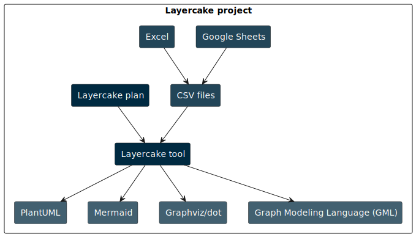

# Layercake

Layercake is an interactive platform for designing, executing, and reviewing graph-based plans. It combines a visual DAG builder, rich graph editors, automated exporters, and agentic tooling across three surfaces: a Rust backend and CLI, a React web application, and a Tauri desktop shell that bundles everything into a single install.



## Feature Highlights

- Visual Workflow Builder – compose plan DAGs with drag-and-drop nodes, data-source wiring, execution states, and automatic dependency tracking.
- Rich Graph Editing – edit nodes, edges, layers, and metadata in spreadsheet or visual modes with live layout controls, layer toggles, and export-ready previews.
- Data Source Management – import CSV/TSV assets, persist raw payloads, and replay transformations through the plan pipeline.
- Desktop & Web Experiences – ship a self-contained Tauri desktop app or run the Vite-powered web UI against the same Rust backend.
- Real-Time Collaboration – share presence, edit history, and live cursor state through the GraphQL + WebSocket collaboration layer.
- Automation & Exporters – run plans headlessly from the CLI, watch for file changes, and emit PlantUML, Graphviz, Mermaid, GML, or custom Handlebars templates.
- Persistent Storage & Audit – all projects, DAGs, edits, and plan runs are stored in SQLite via SeaORM migrations.

## Removed Features
- The chat, RAG, and MCP surfaces have been pulled from this workspace so the product now focuses on the plan editor, graph tools, data acquisition, and exporter flows.

## Repository at a Glance

| Path | Purpose |
|------|---------|
| `layercake-core/` | Rust library crate with core plan/runtime logic, services, database access, and exporter primitives. |
| `layercake-cli/` | Rust CLI binary for plan execution, generators, migrations, updates, and the interactive console. |
| `layercake-server/` | Rust HTTP/GraphQL server binary for the web UI and collaboration endpoints. |
| `frontend/` | Vite + React + Mantine UI with ReactFlow-based plan and graph editors. |
| `src-tauri/` | Tauri 2 shell that embeds the backend, manages SQLite files, and ships the desktop app. |
| `external-modules/` | Optional integrations (e.g. custom connectors and tooling helpers). |
| `resources/` | Sample projects, Handlebars templates, reference exports, and shared assets. |
| `docs/` | Architecture notes, review logs, and migration plans. |
| `scripts/` | Dev/build helpers (`dev.sh`, platform builds, installers). |

## Application Surfaces

### Desktop App (Tauri 2)

- Bundles the backend server and React UI into a single binary, storing data under the OS-specific app data directory.
- Launch for development with:
  ```bash
  npm run tauri:dev
  ```
- Build signed installers per platform:
  ```bash
  npm run tauri:build       # current platform
  npm run tauri:build:macos # or tauri:build:linux / tauri:build:windows
  ```
- The desktop shell starts an embedded server, negotiates a shared secret, and points the UI at it automatically.

### Web Application

1. Start the backend (defaults shown):
   ```bash
  cargo run --bin layercake -- serve \
    --port 3001 \
    --database layercake.db \
    --cors-origin http://localhost:1422
   ```
2. Point the frontend at that API by creating `frontend/.env.local` (or exporting before the next step):
   ```bash
   echo 'VITE_API_BASE_URL=http://localhost:3001' > frontend/.env.local
   ```
3. Run the Vite dev server:
   ```bash
   npm run frontend:dev
   ```

Open http://localhost:1422 to access the plan editor, data source manager, graph editors, and system settings.

The repository also ships `./dev.sh` (web) and `./dev.sh --tauri` (desktop) scripts that wire up the services, enforce ports (`3001`/`1422`), initialize the database, and stream logs.

### CLI & Automation

- Execute plans directly:
  ```bash
  cargo run --bin layercake -- run \
    --plan resources/sample-v1/attack_tree/plan.yaml \
    --watch
  ```
- Initialize a new plan YAML:
  ```bash
  cargo run --bin layercake -- init --plan my-plan.yaml
  ```
- Generate starter projects:
  ```bash
  cargo run --bin layercake -- generate sample attack_tree ./output-dir
  ```
- Run the backend server for remote clients:
  ```bash
  cargo run --bin layercake -- serve --port 8080 --database ./layercake.db
  cargo run --bin layercake-server -- --port 8080 --database ./layercake.db
  ```
- Manage migrations:
  ```bash
  cargo run --bin layercake -- db init
  cargo run --bin layercake -- db migrate up
  cargo run --bin layercake -- db migrate fresh
  ```

The CLI ships optional features for the interactive console (enabled in default builds). See `cargo run --bin layercake -- --help` for the complete command tree.

## Getting Started

### Prerequisites

- Rust 1.70+ with `cargo`
- Node.js 18+ and `npm`
- Git, make, and platform build dependencies listed in [BUILD.md](BUILD.md)
- (Desktop builds) Tauri prerequisites for your OS (WebKit2GTK on Linux, Xcode CLT on macOS, MSVC + WebView2 on Windows)

### Initial Setup

```bash
# Install frontend dependencies
npm run frontend:install

# Optionally warm the Rust workspace
cargo build -p layercake-core -p layercake-cli -p layercake-server
```

### Quick Development Loop

- `./dev.sh` – runs the Rust backend on port `3001` and the Vite dev server on `1422`.
- `./dev.sh --tauri` – launches the desktop shell with hot reload.
- Logs stream to `backend.log`, `frontend.log`, and `tauri.log` in the repo root.

### Database & Storage

- The backend uses SQLite via SeaORM, defaulting to `layercake.db` in the repository (dev) or the platform app data dir (desktop).
- Run `cargo run --bin layercake -- db init` after cloning or deleting the database file to reapply migrations.
- Use `cargo run --bin layercake -- db migrate fresh` to reset schema state during development.

## Working with Projects, Plans, and Graphs

- **Projects** group data sources, plan DAGs, graphs, and collaboration sessions.
- **Plan DAGs** (Plan Visual Editor) orchestrate ingestion, transformation, copy, and export nodes. Changes upstream automatically recompute downstream artifacts.
- **Graphs** can be edited visually or via tabular controls. Edits are stored as replayable `GraphEdits`, so data refreshes reapply your manual changes.
- **Data Sources** record raw payloads plus parsed node/edge/layer JSON, enabling repeatable imports.
- **Exports** use built-in renderers (PlantUML, Graphviz, Mermaid, GML) or custom Handlebars templates located under `resources/library`.
- **Collaboration** uses GraphQL and WebSocket channels to keep multiple clients synchronized on edits, presence, and cursor state.

Sample CSVs, plans, and rendered outputs live in `resources/sample-v1`. Import them through the UI or run the CLI samples to explore the pipeline.

## Testing & Quality

- Backend: `npm run backend:test` (wraps `cargo test -p layercake-core -p layercake-cli -p layercake-server`)
- Frontend type/smoke build: `npm run frontend:build`
- Formatting & linting:
  ```bash
  cargo fmt
  cargo clippy --all-targets --all-features
  ```
- Desktop bundles: `npm run tauri:build` (see [BUILD.md](BUILD.md) for signing/notarization guidance)

## Extending Layercake

- **Export Templates** – add Handlebars templates under `resources/library` and register them in the plan DAG to emit custom text or code artifacts.
- **GraphQL Schema** – extend `layercake-core/src/graphql` resolvers, mutations, and subscriptions to expose custom project or plan workflows.
- **Pipeline Stages** – add Rust modules under `layercake-core/src/pipeline` and wire them into plan execution for custom transformations.
- **Frontend Components** – React components live under `frontend/src/components`; Plan/Graph editors leverage ReactFlow and Mantine for rapid iteration.

## Documentation & References

- [BUILD.md](BUILD.md) – platform prerequisites and packaging instructions.
- [DEV_SCRIPTS.md](DEV_SCRIPTS.md) – details on the `dev.sh` helper.
- [README-Tips.md](README-Tips.md) – watcher tooling, rendering tips, and automation snippets.
- [SPECIFICATION.md](SPECIFICATION.md) – end-to-end product vision, data model, and technology stack.
- `docs/` – collaboration model, mutation refactors, error handling guides, and architecture discussions.

Layercake is evolving rapidly toward distributed collaborative graph editing and automation-focused workflows. Issues, pull requests, and design discussions are welcome!
