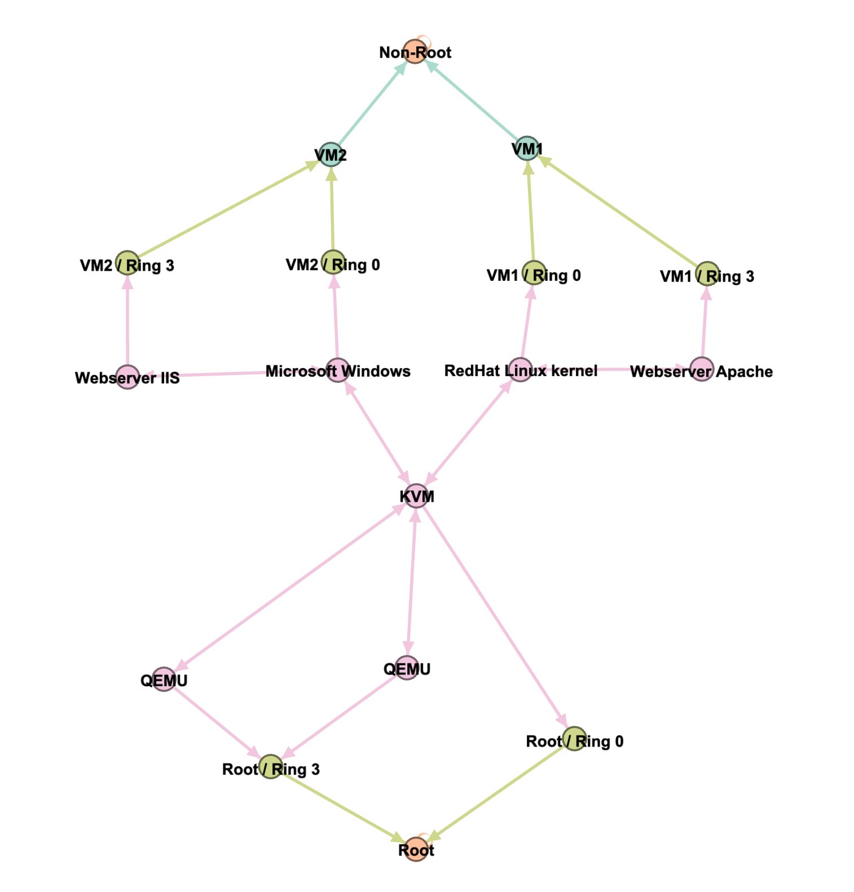
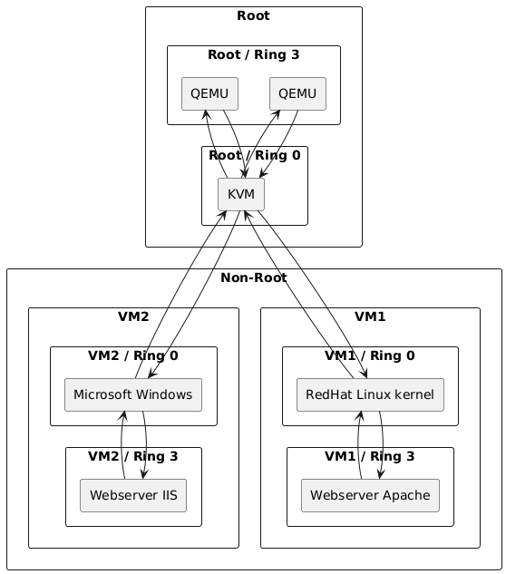

# Layercake tool

## Installation

### MacOS

```
xattr -d com.apple.quarantine ./layercake
```

## Development

### Sample run

```
cargo run -- -p sample/kvm_control_flow_plan.yaml
```

## Rendered examples

_This tool only outputs text files, the following images are rendered using other tools._

### GML rendered with Gephi



### PlantUML rendered


