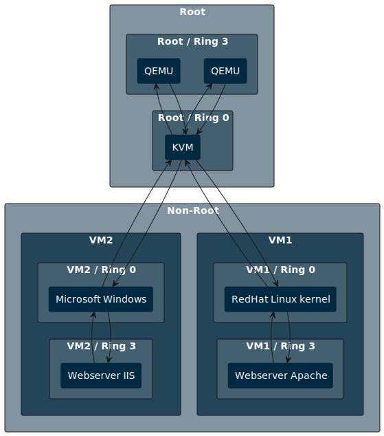
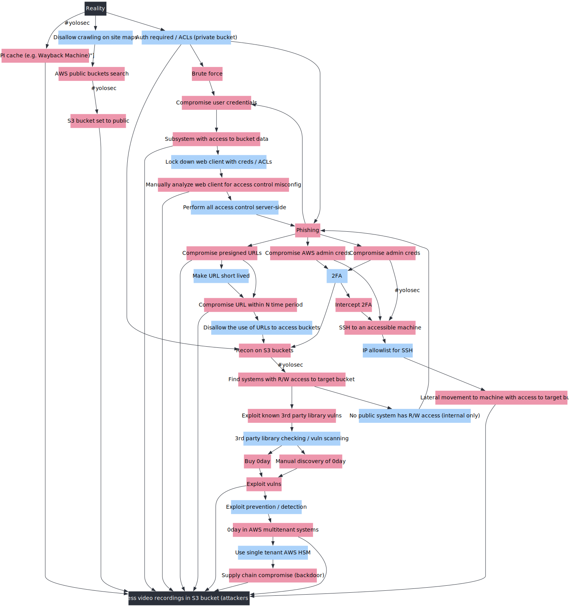

# Layercake tool

This tool takes graph definitions in CSV/TSV format and generates various graph formats for rendering.
Export to,

 - PlantUML
 - Graphviz / dot
 - Mermaid
 - GML (Graph Modeling Language)

Custom renders can be added using [Handlebars](https://handlebarsjs.com/) templates via [handlebars-rust](https://docs.rs/handlebars/latest/handlebars/).


_Project data flow, defined using this project. The data is available in the `sample` directory._

## Installation

### MacOS

```
xattr -d com.apple.quarantine ./layercake
```
## Usage

### Example

Using the sample project,

```
# Generate the sample project
$ layercake generate sample kvm_control_flow
INFO layercake::generate_commands: Sample project generated successfully at: "kvm_control_flow"

# Run the sample project with a plan, this will generate the output files
$ layercake run -p kvm_control_flow/plan.yaml 
INFO layercake: Running plan: kvm_control_flow/plan.yaml

# Run the sample project with a plan, re-run the plan on input changes
$ layercake run -p kvm_control_flow/plan.yaml -w
```


#### Example linux using inotifywait

```bash
while true; \
  do inotifywait -e close-write out/kvm-control-flow.dot && \
  dot -Tpng out/kvm-control-flow.dot -o out/kvm-control-flow.png; \
done
```

#### Example MacOS using built-in stat

```bash
prev_mod_time=$(stat -f "%m" out/kvm-control-flow.dot)                                                                                                                                                                                                                                                                                                [0/1306]

while true; do                                                                         
  sleep 1                                                                              
  new_mod_time=$(stat -f "%m" out/kvm-control-flow.dot)
  if [ "$new_mod_time" -ne "$prev_mod_time" ]; then
    dot -Tpng out/kvm-control-flow.dot -o out/kvm-control-flow.png
    prev_mod_time=$new_mod_time                                                                                                                                                                                                                                                                                                                               
  fi                                                                                                                                                                                                                                                                                                                                                          
done
```

#### Example MacOS using fswatch

```bash
while true; do
  fswatch -1 -e ".*" -i "out/kvm-control-flow.dot" out/ && \
  dot -Tpng out/kvm-control-flow.dot -o out/kvm-control-flow.png
done
```

## Development

### Sample run

```
cargo run -- -p sample/kvm_control_flow_plan.yaml
```

## Rendered examples

_This tool only outputs text files, the following images are rendered using other tools._

### GML rendered with Gephi
Sample control for for virtualized x86 architecture, output to GML and rendered using Gephi.


### PlantUML rendered
Sample control for for virtualized x86 architecture, output rendered using [PlantUML](https://plantuml.com/).



### Graphviz rendered
Sample attack tree from [Kelly Shortridge's Security Descision Trees with Graphviz](https://kellyshortridge.com/blog/posts/security-decision-trees-with-graphviz/) output rendered using [Graphviz](https://graphviz.org/)




