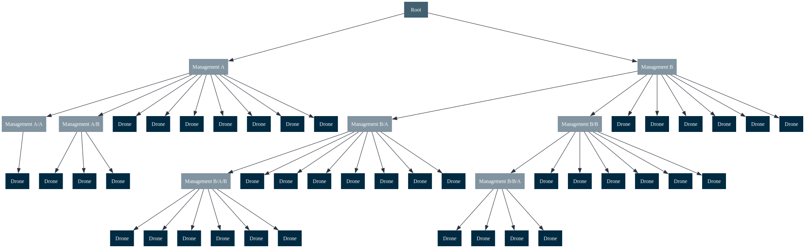
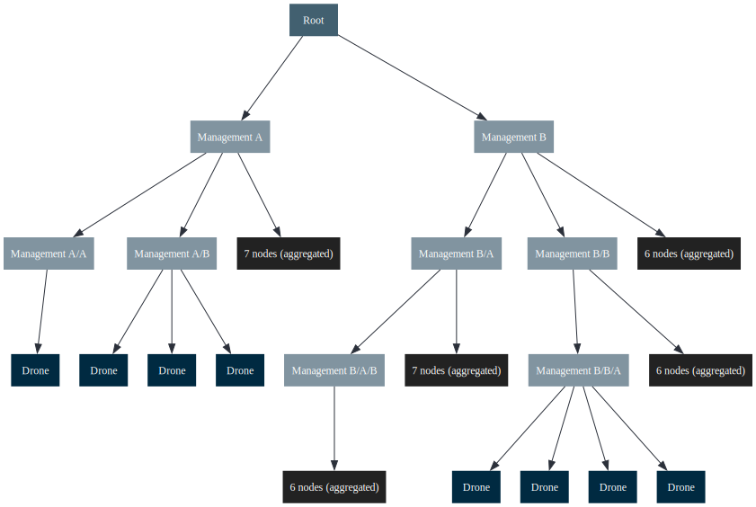
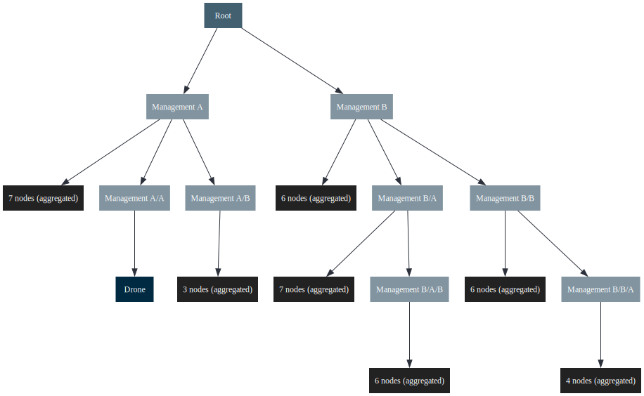

# Layercake tool

This tool takes graph definitions in CSV/TSV format and generates various graph formats for rendering.
Export to,

 - PlantUML
 - Graphviz / dot
 - Mermaid
 - GML (Graph Modeling Language)

Custom renders can be added using [Handlebars](https://handlebarsjs.com/) templates via [handlebars-rust](https://docs.rs/handlebars/latest/handlebars/).


_Project data flow, defined using this project. The data is available in the `sample` directory._

## Installation

### One-Line Install (Recommended)

The easiest way to install Layercake is using our install script:

**Linux/macOS:**
```bash
# Install latest release directly from GitHub
curl -fsSL https://raw.githubusercontent.com/michiel/layercake-tool/master/scripts/install.sh | bash
```

**Windows (PowerShell):**
```powershell
# Install latest release directly from GitHub
irm https://raw.githubusercontent.com/michiel/layercake-tool/master/scripts/install.ps1 | iex
```

This script will:
- ✅ Detect your platform and architecture automatically
- ✅ Download the latest release from GitHub
- ✅ Install to `~/.local/bin` (no sudo required)
- ✅ Check if the install directory is in your PATH
- ✅ Provide instructions to add it to PATH if needed

### Manual Installation

Download a release from the [releases page](https://github.com/michiel/layercake-tool/releases).

#### MacOS

Remove the quarantine attribute from the binary,
```
xattr -d com.apple.quarantine ./layercake
```

Or from the DMG installation

```
xattr -d com.apple.quarantine /Applications/Layercake.app
```

## Concepts

Nodes come in two types, partition and non-partition nodes. Partition nodes are used to group nodes together, and are used to create a hierarchy in the graph.

## Usage

See also [the tips and snippets](README-Tips.md) for file watchers, command line rendering, etc

### Example

Using the sample project,


```bash
# Generate a sample project
layercake generate sample attack_tree example-project

# Run the sample project with a plan, this will generate the output files
layercake run -p example-project/plan.yaml 

# Run the sample project with a plan, re-run the plan on input changes
layercake run -p example-project/plan.yaml -w
```

Now edit and change the CSV files. A collaborative workflow might include Google Sheets, with separate sheets for nodes and edges, followed by export to CSV. If you make local changes, re-import the changed CSV files back to the source.

If you want to re-run the plan on input changes, you can use the `-w` (**watch**) flag. This will re-run the plan when any of the input files change. If you want to automatically generate images 
from the output files, you can use a file watcher.


## Development

### Sample run

```
cargo run -- -p sample/kvm_control_flow_plan.yaml
```

### Console and Chat

```
cargo run -- console
```

The interactive console lets you:

- `list-projects` to enumerate available datasets
- `use-project <id>` to change the active context
- `list-graphs` / `show-graph <id>` for quick metadata checks
- `chat [--provider <ollama|openai|gemini|claude>]` to launch an LLM session with full MCP tool access

#### Configuring LLM Providers

Provider credentials may be stored in the `chat_credentials` table or supplied through environment variables.

**Using the CLI:**

```bash
# List configured providers
cargo run -- chat-credentials list

# Configure OpenAI (or OpenAI-compatible API)
cargo run -- chat-credentials set openai --api-key sk-... --base-url https://api.openai.com

# Configure a custom OpenAI-compatible endpoint (e.g., LM Studio, vLLM, Ollama with OpenAI compatibility)
cargo run -- chat-credentials set openai --api-key custom-key --base-url http://localhost:8000/v1

# Configure Anthropic Claude
cargo run -- chat-credentials set claude --api-key sk-ant-...

# Configure Google Gemini
cargo run -- chat-credentials set gemini --api-key AIza...

# Configure Ollama
cargo run -- chat-credentials set ollama --base-url http://localhost:11434

# Clear credentials for a provider
cargo run -- chat-credentials clear gemini
```

**Using environment variables:**

```bash
# OpenAI
export OPENAI_API_KEY=sk-...
export OPENAI_BASE_URL=https://api.openai.com  # Optional, defaults to OpenAI

# OpenAI-compatible endpoints (e.g., LM Studio, vLLM)
export OPENAI_API_KEY=custom-key
export OPENAI_BASE_URL=http://localhost:8000/v1

# Anthropic Claude
export ANTHROPIC_API_KEY=sk-ant-...

# Google Gemini
export GOOGLE_API_KEY=AIza...

# Ollama
export OLLAMA_BASE_URL=http://localhost:11434

# Model selection (optional, provider-specific defaults used if not set)
export LAYERCAKE_OPENAI_MODEL=gpt-4o-mini
export LAYERCAKE_CLAUDE_MODEL=claude-3-5-sonnet-20241010
export LAYERCAKE_GEMINI_MODEL=gemini-2.0-flash-exp
export LAYERCAKE_OLLAMA_MODEL=llama3:8b
```

**OpenAPI-Compatible Endpoints:**

The `openai` provider supports any OpenAI API-compatible endpoint. This works with:
- **OpenAI** - Official OpenAI API
- **LM Studio** - Local model serving (http://localhost:1234/v1)
- **vLLM** - High-performance inference server
- **Ollama with OpenAI compatibility** - Use Ollama's OpenAI-compatible endpoint
- **Text generation web UI** - API mode with OpenAI compatibility
- **Any service implementing the OpenAI Chat Completions API**

Simply set the `--base-url` to point to your endpoint and provide the appropriate API key (use any string if authentication isn't required).

The database migrations seed empty records for every built-in provider, so the CLI helper simply updates the stored secrets without requiring manual inserts.

#### GraphQL Chat Operations

GraphQL exposes chat operations when the server is running with the `graphql` feature enabled:

- `startChatSession(projectId, provider, message?)` - Create a new chat session
- `sendChatMessage(sessionId, message)` - Send a message to an active session
- `subscription { chatEvents(sessionId) { kind message toolName } }` - Stream responses

Responses stream tool invocations and assistant replies in real-time via WebSocket subscriptions, making it easy to drive the console workflow from the web UI.

## Rendered examples

_This tool only outputs text files, the following images are rendered using other tools._

### GML rendered with Gephi
Sample control for for virtualized x86 architecture, output to GML and rendered using Gephi.


### PlantUML rendered
Sample control for for virtualized x86 architecture, output rendered using [PlantUML](https://plantuml.com/).


### Graphviz rendered
Sample attack tree from [Kelly Shortridge's Security Descision Trees with Graphviz](https://kellyshortridge.com/blog/posts/security-decision-trees-with-graphviz/) output rendered using [Graphviz](https://graphviz.org/)


## Graph transformations

### Partition width

Aggregate the nodes in a partition of the limit exceeds the set parameter (`partition_width`).


_Reference model with no transformation_


_Reference model with a partition width of 5_


_Reference model with a partition width of 2_

