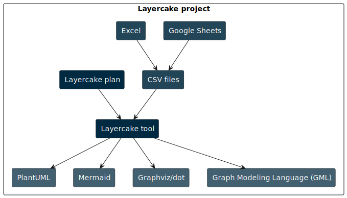

# Layercake

Layercake is an interactive platform for designing, executing, and reviewing graph-based plans. It combines a visual DAG builder, rich graph editors, automated exporters, and collaboration tooling. The Rust backend, CLI, and React web UI ship together as a single `layercake` binary: the web UI is embedded directly into the binary and served same-origin with the GraphQL API.



## Feature Highlights

- Visual Workflow Builder – compose plan DAGs with drag-and-drop nodes, data-source wiring, execution states, and automatic dependency tracking.
- Rich Graph Editing – edit nodes, edges, layers, and metadata in spreadsheet or visual modes with live layout controls, layer toggles, and export-ready previews.
- Data Source Management – import CSV/TSV assets, persist raw payloads, and replay transformations through the plan pipeline.
- Single Self-Contained Binary – the web UI is compiled into the `layercake` binary and served same-origin with the GraphQL API; run it locally or self-host, with a Vite-powered dev mode for frontend iteration.
- Real-Time Collaboration – share presence, edit history, and live cursor state through the GraphQL + WebSocket collaboration layer.
- Automation & Exporters – run plans headlessly from the CLI, watch for file changes, and emit PlantUML, Graphviz, Mermaid, GML, or custom Handlebars templates.
- Persistent Storage & Audit – all projects, DAGs, edits, and plan runs are stored in SQLite via SeaORM migrations.

## Installation

- **Quick install on Linux/macOS:** download and run the installer that grabs the latest CLI release for your platform.
  ```bash
  curl -sL https://raw.githubusercontent.com/michiel/layercake-tool/master/scripts/install.sh | bash
  ```
  Optionally override the install path for a user-local location:
  ```bash
  LAYERCAKE_INSTALL_DIR="/opt/bin" curl -sL https://raw.githubusercontent.com/michiel/layercake-tool/master/scripts/install.sh | bash
  ```

- **Windows install (PowerShell):** invoke the installer that now tracks the CLI release. Run from PowerShell 5.1+ or `pwsh`:
  ```powershell
  irm https://raw.githubusercontent.com/michiel/layercake-tool/master/scripts/install.ps1 | pwsh -NoProfile -
  ```
  Use `-InstallDir C:\tools\layercake` to override the default `~\.local\bin` path.

- **Post-install:** ensure the chosen install directory is on `PATH` (the scripts remind you how) and verify by running `layercake --version`.

## Removed Features
- The chat, RAG, and MCP surfaces have been pulled from this workspace so the product now focuses on the plan editor, graph tools, data acquisition, and exporter flows. See `plans/20260122-de-feature.md` for the implementation log and rationale behind the de-feature effort.

## Repository at a Glance

| Path | Purpose |
|------|---------|
| `layercake-core/` | Rust library crate with core plan/runtime logic, services, database access, and exporter primitives. |
| `layercake-cli/` | Rust CLI binary for plan execution, generators, migrations, updates, and the interactive console. |
| `layercake-server/` | Rust HTTP/GraphQL server binary for the web UI and collaboration endpoints. |
| `frontend/` | Vite + React + Mantine UI with ReactFlow-based plan and graph editors. |
| `external-modules/` | Optional integrations (e.g. custom connectors and tooling helpers). |
| `resources/` | Sample projects, Handlebars templates, reference exports, and shared assets. |
| `docs/` | Architecture notes, review logs, and migration plans. |
| `scripts/` | Dev/build helpers (`dev.sh`, platform builds, installers). |

## Application Surfaces

### Single Binary

- The web UI (`frontend/dist`) is compiled into the `layercake` binary at build time via `include_dir!`, so the frontend MUST be built before the Rust build.
- Build the release binary (frontend first, then the Rust binary):
  ```bash
  npm run build:binary   # runs frontend:build, then cargo build --release -p layercake-cli
  ```
- Run the server, serving the embedded web UI same-origin with the GraphQL API:
  ```bash
  layercake serve --open   # --open auto-launches the browser
  ```
  By default the server binds to loopback (`127.0.0.1:3000`) for local-first use. Pass `--host 0.0.0.0` to self-host or expose it on a network. Other flags: `--port`, `--database`, `--cors-origin`.

### Web Application

1. Start the backend (defaults shown):
   ```bash
  cargo run --bin layercake -- serve \
    --port 3001 \
    --database layercake.db \
    --cors-origin http://localhost:1422
   ```
2. Point the frontend at that API by creating `frontend/.env.local` (or exporting before the next step):
   ```bash
   echo 'VITE_API_BASE_URL=http://localhost:3001' > frontend/.env.local
   ```
3. Run the Vite dev server:
   ```bash
   npm run frontend:dev
   ```

Open http://localhost:1422 to access the plan editor, data source manager, graph editors, and system settings.

The repository also ships `./dev.sh` (web dev) which wires up the services, enforces ports (`3001`/`1422`), initializes the database, and streams logs.

### CLI & Automation

- Execute plans directly:
  ```bash
  cargo run --bin layercake -- run \
    --plan resources/sample-v1/attack_tree/plan.yaml \
    --watch
  ```
- Initialize a new plan YAML:
  ```bash
  cargo run --bin layercake -- init --plan my-plan.yaml
  ```
- Generate starter projects:
  ```bash
  cargo run --bin layercake -- generate sample attack_tree ./output-dir
  ```
- Run the backend server for remote clients:
  ```bash
  cargo run --bin layercake -- serve --port 8080 --database ./layercake.db
  cargo run --bin layercake-server -- --port 8080 --database ./layercake.db
  ```
- Manage migrations:
  ```bash
  cargo run --bin layercake -- db init
  cargo run --bin layercake -- db migrate up
  cargo run --bin layercake -- db migrate fresh
  ```

The CLI ships optional features for the interactive console (enabled in default builds). See `cargo run --bin layercake -- --help` for the complete command tree.

### Query & REPL automation

- `layercake query` now exposes a JSON-first surface for managing datasets, plans, DAG nodes/edges, and export previews. Supply `--project`/`--plan`, `--entity` (datasets, plans, nodes, edges, exports), `--action` (`list`, `get`, `create`, `update`, `delete`, `move`, `download`), and `--payload-json` or `--payload-file`. Output stays JSON (`--pretty` optional) so agents can read canonical `dataset:PROJECT:DATASET`, `plan:PROJECT:PLAN`, and `plannode:PROJECT:PLAN:NODE` identifiers after every mutation.

  ```bash
  layercake query --entity nodes --action list --project 5 --plan 2
  layercake query --entity nodes --action create --project 5 --plan 2 \
    --payload-json '{"nodeType":"GraphNode","position":{"x":0,"y":0},"metadata":{"label":"My Node"},"config":"{}"}'
  layercake query --entity exports --action download \
    --payload-json '{"graphId":17,"format":"JSON"}' --output-file /tmp/graph.json
  ```

- `layercake repl` boots a REPL that keeps project/plan context (`set project=5`, `set plan=2`), understands shortcuts such as `list nodes`, `create node {... }`, `move node {... }`, `delete edge {... }`, and `download export {... } --output /tmp/file`. Every command prints a single-line JSON object with `status`, `command`, and the canonical ID results so agents can parse responses reliably.

- Dataset and plan listings now show their canonical IDs (`dataset:PROJECT:ID`, `plan:PROJECT:ID`) with a copy button, and every PlanVisualEditor node exposes the `plannode:PROJECT:PLAN:NODE` ID and a copy action. Grab an ID from the UI and reuse it directly in automation or conversation without guessing the underlying identifiers.

## Getting Started

### Prerequisites

- Rust 1.70+ with `cargo`
- Node.js 18+ and `npm`
- Git, make, and platform build dependencies listed in [BUILD.md](BUILD.md)

### Initial Setup

```bash
# Install frontend dependencies
npm run frontend:install

# Optionally warm the Rust workspace
cargo build -p layercake-core -p layercake-cli -p layercake-server
```

### Quick Development Loop

- `./dev.sh` – runs the Rust backend on port `3001` and the Vite dev server on `1422`.
- Logs stream to `backend.log` and `frontend.log` in the repo root.

### Database & Storage

- The backend uses SQLite via SeaORM, defaulting to `layercake.db` in the repository (or the path passed to `--database`).
- Run `cargo run --bin layercake -- db init` after cloning or deleting the database file to reapply migrations.
- Use `cargo run --bin layercake -- db migrate fresh` to reset schema state during development.

## Working with Projects, Plans, and Graphs

- **Projects** group data sources, plan DAGs, graphs, and collaboration sessions.
- **Plan DAGs** (Plan Visual Editor) orchestrate ingestion, transformation, copy, and export nodes. Changes upstream automatically recompute downstream artifacts.
- **Graphs** can be edited visually or via tabular controls. Edits are stored as replayable `GraphEdits`, so data refreshes reapply your manual changes.
- **Data Sources** record raw payloads plus parsed node/edge/layer JSON, enabling repeatable imports.
- **Exports** use built-in renderers (PlantUML, Graphviz, Mermaid, GML) or custom Handlebars templates located under `resources/library`.
- **Collaboration** uses GraphQL and WebSocket channels to keep multiple clients synchronized on edits, presence, and cursor state.

Sample CSVs, plans, and rendered outputs live in `resources/sample-v1`. Import them through the UI or run the CLI samples to explore the pipeline.

## Testing & Quality

- Backend: `npm run backend:test` (wraps `cargo test -p layercake-core -p layercake-cli -p layercake-server`)
- Frontend type/smoke build: `npm run frontend:build`
- Formatting & linting:
  ```bash
  cargo fmt
  cargo clippy --all-targets --all-features
  ```
- Release binary: `npm run build:binary` (see [BUILD.md](BUILD.md) for packaging guidance)

## Extending Layercake

- **Export Templates** – add Handlebars templates under `resources/library` and register them in the plan DAG to emit custom text or code artifacts.
- **GraphQL Schema** – extend `layercake-core/src/graphql` resolvers, mutations, and subscriptions to expose custom project or plan workflows.
- **Pipeline Stages** – add Rust modules under `layercake-core/src/pipeline` and wire them into plan execution for custom transformations.
- **Frontend Components** – React components live under `frontend/src/components`; Plan/Graph editors leverage ReactFlow and Mantine for rapid iteration.

## Agents / API access

Layercake is built to be driven by AI agents against a running instance. The
binary ships embedded, discoverable docs:

```bash
layercake doc list                       # discover agent workflows & commands
layercake schema dump                    # full GraphQL API surface (offline)
layercake api info                       # endpoints + session header
layercake api call --query '{ … }'       # run a GraphQL op on a running server
layercake db info                        # database file location/size
layercake api join --project N --agent   # appear as a collaborator in the UI
```

Start with `layercake doc list`, then read the workflow that matches your task
(e.g. `layercake doc workflow develop-a-story`, `edit-a-plan`,
`join-as-collaborator`). See `docs-tool/` for the source of these guides.

## Documentation & References

- [BUILD.md](BUILD.md) – platform prerequisites and packaging instructions.
- [DEV_SCRIPTS.md](DEV_SCRIPTS.md) – details on the `dev.sh` helper.
- [README-Tips.md](README-Tips.md) – watcher tooling, rendering tips, and automation snippets.
- [SPECIFICATION.md](SPECIFICATION.md) – end-to-end product vision, data model, and technology stack.
- `docs/` – collaboration model, mutation refactors, error handling guides, and architecture discussions.

Layercake is evolving rapidly toward distributed collaborative graph editing and automation-focused workflows. Issues, pull requests, and design discussions are welcome!

## Code flow card


