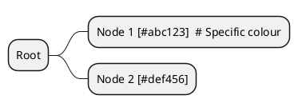

# Layer Styling Implementation Review

**Date:** 2025-11-15
**Status:** Investigation Complete

## Executive Summary

This review investigates why layer styling is not consistently applied across handlebars templates when the `apply_layers` render option is set. The investigation reveals significant gaps in layer styling implementation across multiple export formats, particularly in hierarchy rendering modes and specialised visualisation types (mindmaps, treemaps, WBS).

## Background

Layer styling in Layercake Tool allows users to apply visual differentiation to nodes and edges based on their layer membership. Each layer entity has three colour properties:
- `background_color` - fill colour for nodes
- `text_color` - font colour for node labels
- `border_color` - border/stroke colour for nodes

The `apply_layers` boolean flag in `RenderConfig` controls whether these layer styles should be applied in exported visualisations.

## Configuration Flow

The layer styling configuration flows through the system as follows:

1. **Plan Configuration** (`plan.yaml`):
   ```yaml
   render_config:
     apply_layers: true
     built_in_styles: "light"
   ```

2. **Rust Types** (`layercake-core/src/plan.rs`):
   - `ExportProfileRenderConfig` (user-facing config, all fields optional)
   - `RenderConfig` (resolved config with defaults, passed to templates)
   - `RenderTargetOptions` (format-specific options for Graphviz, Mermaid, etc.)

3. **Template Context** (`layercake-core/src/export/mod.rs`):
   ```rust
   json!({
       "config": render_config,  // Contains apply_layers flag
       "layers": graph.get_layer_map(),  // Layer definitions with colours
       "flow_nodes": ...,
       "hierarchy_tree": ...,
   })
   ```

4. **Handlebars Templates** (`*.hbs`):
   - Check `{{#if config.apply_layers}}`
   - Apply layer-specific styling using target syntax (DOT, PlantUML, Mermaid, etc.)

## Implementation Status by Export Format

### ✅ Fully Implemented

#### DOT (Graphviz) - Flat Mode
**Template:** `to_dot.hbs`
**Lines:** 46-60

**Implementation:**
- Correctly checks `{{#if config.apply_layers}}` before applying layer styles
- Groups nodes by layer using DOT's node attribute blocks
- Applies `fillcolor`, `fontcolor`, and `color` (border) from layer definitions
- Falls back to default styling when `apply_layers` is false

**Syntax:**
```dot
node [fillcolor="#abc123" fontcolor="#def456" color="#789abc"]; {
  node1[label="Node 1"];
  node2[label="Node 2"];
}
```

**Assessment:** Well-implemented, readable, maintainable.

#### PlantUML - Flat and Hierarchy Modes
**Template:** `to_plantuml.hbs`
**Lines:** 32-42 (style definitions), 50 (node assignment)

**Implementation:**
- Correctly checks `{{#if config.apply_layers}}`
- Defines CSS-style classes for each layer inside `<style>` block
- Assigns nodes to layers using stereotype syntax: `<<layerId>>`
- Helper `puml_render_tree` (handlebars.rs:84-142) correctly applies layers in hierarchy mode

**Syntax:**
```plantuml
<style>
.layer1 {
    BackgroundColor #abc123;
    BorderColor #789abc;
    FontColor #def456;
}
</style>
rectangle "Node" as node1 <<layer1>>
```

**Assessment:** Excellent implementation. Clean, maintainable, follows PlantUML best practices.

#### Mermaid - Flat Mode Only
**Template:** `to_mermaid.hbs`
**Lines:** 31-38

**Implementation:**
- Correctly checks `{{#if config.apply_layers}}`
- Defines `classDef` for each layer with fill, color (text), and stroke (border)
- Assigns each node to its layer's class

**Syntax:**
```mermaid
classDef layer1 fill:#abc123,color:#def456,stroke:#789abc;
class node1 layer1;
```

**Assessment:** Well-implemented for flat mode. **Gap identified in hierarchy mode** (see below).

### ⚠️ Partially Implemented

#### DOT Hierarchy
**Template:** `to_dot_hierarchy.hbs`
**Lines:** 21-29, 35

**Issues:**
1. **Always applies layer styling** - does not check `config.apply_layers`
2. Inconsistent with other templates that respect the flag
3. Line 35 has malformed edge label colour logic

**Current Code:**
```handlebars
{{#each layers as |layer|}}
node [fillcolor="#{{layer.background_color}}" ...]; {
  {{#each ../hierarchy_nodes as |node|}}
    {{#if (eq node.layer layer.id)}}
      {{node.id}}[label="{{node.label}}"];
    {{/if}}
  {{/each}}
}
{{/each}}
```

**Recommended Fix:**
```handlebars
{{#if config.apply_layers}}
  {{#each layers as |layer|}}
  node [fillcolor="#{{layer.background_color}}" ...]; {
    {{#each ../hierarchy_nodes as |node|}}
      {{#if (eq node.layer layer.id)}}
        {{node.id}}[label="{{node.label}}"];
      {{/if}}
    {{/each}}
  }
  {{/each}}
{{else}}
  {{#each hierarchy_nodes as |node|}}
    {{node.id}}[label="{{node.label}}"];
  {{/each}}
{{/if}}
```

**Assessment:** Needs conditional logic added. Moderate priority.

### ❌ Not Implemented

#### Mermaid - Hierarchy Mode
**Helper:** `mermaid_render_tree` (handlebars.rs:144-175)
**Template:** `to_mermaid.hbs` (uses helper for hierarchy rendering)

**Issues:**
1. Helper does not accept `layers` or `config` parameters
2. Cannot apply layer styling to nodes rendered within subgraphs
3. When `contain_nodes: true`, nodes in hierarchy lose their layer colours

**Current Helper Signature:**
```rust
handlebars_helper!(mermaid_render_tree: |node: Value| { ... });
```

**Comparison with DOT Helper:**
```rust
handlebars_helper!(dot_render_tree: |node: Value, layermap: Value, style_config: Value| {
    let apply_layers = style_map
        .get("apply_layers")
        .and_then(|v| v.as_bool())
        .unwrap_or(true);

    if apply_layers {
        // Apply layer styling from layermap
    }
});
```

**Recommended Fix:**
1. Update helper signature to accept `layermap` and `style_config` parameters (matching `dot_render_tree`)
2. Extract layer colours from layermap when rendering leaf nodes
3. Check `apply_layers` flag before applying styling
4. Update template invocation: `{{{mermaid_render_tree rootnode ../layers ../config}}}`

**Impact:** High. Affects any Mermaid export with `contain_nodes: true`.

**Example Gap:**
```yaml
# Plan config
render_config:
  contain_nodes: true
  apply_layers: true
```

**Current Output:**
```mermaid
subgraph "Container"
  node1["Node 1"]  # No layer styling applied
  node2["Node 2"]
end
class node1 layer1;  # Class defined but not visible in subgraph
```

**Expected Output:**
```mermaid
subgraph "Container"
  node1["Node 1"]
  node2["Node 2"]
end
classDef layer1 fill:#abc123,color:#def456,stroke:#789abc;
class node1 layer1;  # Styling should be visible
```

**Note:** Mermaid's styling model may have limitations with subgraph styling. Further investigation needed to determine if `classDef` works within subgraphs or if alternative syntax is required.

#### Mermaid Mindmap
**Template:** `to_mermaid_mindmap.hbs`

**Issues:**
1. No layer styling support at all
2. Mermaid mindmap syntax may not support colour customisation per node
3. Specification unclear on styling capabilities

**Current State:**
```mermaid
mindmap
  root(("Root"))
    node1["Child 1"]  # No layer colours
    node2["Child 2"]
```

**Recommendation:**
1. Research Mermaid mindmap styling capabilities
2. If supported, add layer class definitions and assignments
3. If not supported by Mermaid, document limitation and consider:
   - Adding layer info as node annotations
   - Recommending alternative formats for layer-styled mindmaps

**Assessment:** Low priority. Mindmap format may not support layer styling.

#### Mermaid Treemap
**Template:** `to_mermaid_treemap.hbs`

**Issues:**
Same as Mermaid Mindmap. Treemap is a beta Mermaid feature with limited styling support.

**Recommendation:**
1. Monitor Mermaid treemap feature development
2. Add layer styling when feature supports it
3. Document current limitation

**Assessment:** Low priority. Beta feature with limited capabilities.

#### PlantUML Mindmap
**Template:** `to_plantuml_mindmap.hbs`

**Issues:**
1. No layer styling implementation
2. PlantUML mindmap syntax supports styling via node type suffixes

**Potential Solution:**
PlantUML mindmaps support node styling using suffixes:


**Recommended Fix:**
1. Add layer colour lookup in render_node partial
2. Append `[#{{layer.background_color}}]` to node labels when `apply_layers` is true
3. May require updating the inline partial to accept layer context

**Assessment:** Medium priority. PlantUML supports this; implementation is straightforward.

#### PlantUML WBS
**Template:** `to_plantuml_wbs.hbs`

**Issues:**
Same as PlantUML Mindmap. WBS (Work Breakdown Structure) uses similar syntax.

**Recommended Fix:**
Same approach as PlantUML Mindmap.

**Assessment:** Medium priority.

### ℹ️ Data Formats (Styling Not Applicable)

#### GML
**Template:** `to_gml.hbs`

**Current Behaviour:**
Includes layer metadata as node/edge properties:
```gml
node [
  id 1
  label "Node 1"
  layer "layer1"  # Layer preserved as metadata
]
```

**Assessment:** Correct behaviour. GML is a data interchange format. Layer information is preserved for consumption by other tools. No visual styling needed.

#### JSON
**Export:** Structured data export

**Assessment:** Correct. Layer information included in node metadata.

#### CSV Nodes/Edges/Matrix
**Exports:** Tabular data

**Assessment:** Correct. Layer information included as columns.

#### JSGraph
**Template:** `to_jsgraph.hbs`

**Current Behaviour:**
Outputs JavaScript variables with graph data and config:
```javascript
window.graphData = {...};
window.graphConfig = {...};
```

**Assessment:** Need to verify that `graphData` includes layer colour information for JavaScript consumption. If the data structure includes layer metadata, this is sufficient. The consuming JavaScript code is responsible for applying styling.

**Action Required:** Review JavaScript graph rendering code to ensure it uses layer colours from the data.

## Custom Templates

#### Custom Template Example
**File:** `resources/sample-v1/kvm_control_flow/custom.hbs`
**Lines:** 12-20

**Issues:**
1. Always applies layer styling without checking `config.apply_layers`
2. Should serve as exemplar for custom template authors

**Recommended Fix:**
```handlebars
{{#if config.apply_layers}}
  {{#each layers as |layer|}}
  node [style="filled, dashed" fillcolor="#{{layer.background_color}}" ...]; {
    {{#each ../nodes as |node|}}
      {{#if (eq node.layer layer.id)}}
        {{node.id}}[label="{{node.label}}"];
      {{/if}}
    {{/each}}
  }
  {{/each}}
{{else}}
  {{#each nodes as |node|}}
    {{node.id}}[label="{{node.label}}"];
  {{/each}}
{{/if}}
```

**Assessment:** Update as reference implementation for custom template authors.

## Target-Specific Rendering Options

The `RenderTargetOptions` structure provides format-specific configuration:

### Graphviz Options
**Type:** `GraphvizRenderOptions`

**Properties:**
- `layout`: Layout algorithm (dot, neato, fdp, circo)
- `overlap`: Allow node overlap
- `splines`: Edge routing style
- `nodesep`: Minimum node separation
- `ranksep`: Minimum rank separation

**Status:** Well-integrated in `to_dot.hbs` and `to_dot_hierarchy.hbs` templates.

### Mermaid Options
**Type:** `MermaidRenderOptions`

**Properties:**
- `look`: Appearance style (default, handDrawn)
- `display`: Display mode (full, compact)

**Status:** Well-integrated in Mermaid templates via frontmatter:
```yaml
---
config:
  look: {{mm.look}}
  displayMode: {{mm.display}}
---
```

**Assessment:** Target options are properly implemented and independent of layer styling.

## Recommendations

### Priority 1: Critical Gaps

1. **Fix Mermaid Hierarchy Rendering**
   - Update `mermaid_render_tree` helper to accept layer and config parameters
   - Implement layer styling for nodes within subgraphs
   - Test Mermaid class definitions work correctly inside subgraphs
   - **Impact:** High - affects common use case (hierarchy + layer colours)

2. **Fix DOT Hierarchy Conditional Logic**
   - Add `{{#if config.apply_layers}}` wrapper
   - Provide fallback rendering when flag is false
   - Fix edge label colour logic (line 35)
   - **Impact:** Medium - inconsistent with other templates

### Priority 2: Feature Completeness

3. **Implement PlantUML Mindmap/WBS Layer Styling**
   - Add layer colour lookup to inline partials
   - Apply `[#color]` syntax when `apply_layers` is true
   - **Impact:** Medium - improves consistency across PlantUML formats

4. **Update Custom Template Examples**
   - Fix `kvm_control_flow/custom.hbs` to check `apply_layers`
   - Add comments explaining proper layer styling usage
   - **Impact:** Low - but important for documentation

### Priority 3: Research and Future Work

5. **Investigate Mermaid Mindmap/Treemap Styling**
   - Research current Mermaid capabilities for these formats
   - Document findings and limitations
   - Implement if feasible, otherwise document limitation
   - **Impact:** Low - niche formats with possible upstream limitations

6. **Review JSGraph Data Structure**
   - Verify layer colour information is included in `graphData`
   - Update consuming JavaScript to use layer colours
   - **Impact:** Medium if JavaScript rendering doesn't use layer colours

### Code Quality Improvements

7. **Template Readability**
   - Extract repeated layer styling blocks into Handlebars partials
   - Define partials like `{{> layer_group}}` for DOT, `{{> layer_classes}}` for Mermaid
   - Reduce conditional nesting depth
   - Add explanatory comments for complex logic

8. **Helper Consistency**
   - Standardise tree rendering helper signatures:
     ```rust
     (node: Value, layermap: Value, style_config: Value)
     ```
   - All tree helpers should support layer styling consistently

9. **Test Coverage**
   - Add golden tests for `apply_layers: false` scenarios
   - Test each export format with and without layer styling
   - Test hierarchy mode with layer styling for all formats

## Technical Constraints

### Mermaid Subgraph Styling Limitations

Mermaid's class definition system may not reliably style nodes within subgraphs. Testing is required to determine:
1. Whether `classDef` definitions apply to nodes in subgraphs
2. If alternative syntax (inline styles) is needed
3. Whether this is a Mermaid limitation requiring upstream fix

**Action:** Create minimal test case and verify behaviour.

### PlantUML Stereotype vs Inline Colour

PlantUML offers two styling approaches:
1. **Stereotypes with CSS** (current implementation): Clean, maintainable, but requires `<style>` block
2. **Inline colours**: Less clean but more widely supported

The current stereotype approach is preferable for maintainability. No change recommended.

### Handlebars Partial Limitations

Handlebars partials cannot be defined in separate files when using `include_str!` macro. Template readability improvements should use inline partials:
```handlebars
{{#*inline "layer_group"}}
  node [fillcolor="#{{layer.background_color}}" ...];
{{/inline}}
```

## Migration Considerations

The `styling-update.md` plan outlines the migration from legacy `use_default_styling` to the new `apply_layers` + `built_in_styles` model. Current findings align with that plan:

### Backend Implementation Status

✅ **Complete:**
- `RenderConfig` structure includes `apply_layers` and `built_in_styles`
- Default values are set correctly
- Configuration flows to templates via context

✅ **Working:**
- Most templates correctly use `config.apply_layers`
- Templates use `config.built_in_styles` for global theme

❌ **Gaps:**
- Hierarchy mode for Mermaid (missing layer support)
- DOT hierarchy (missing conditional logic)
- Mindmap/WBS formats (missing layer support)

### Template Quality Standards

To ensure maintainability and readability, templates should follow these principles:

1. **Optimised for Target Syntax**
   - Use idiomatic syntax for each format (DOT clusters, PlantUML stereotypes, Mermaid classes)
   - Avoid clever hacks; prefer clear, documented approaches

2. **Readable Structure**
   - Keep conditional nesting shallow (max 2-3 levels)
   - Use inline partials for repeated blocks
   - Add comments explaining non-obvious logic

3. **Maintainable Patterns**
   - Consistent naming: `layer`, `layers`, `layermap`, `config.apply_layers`
   - Standard helper signatures across all tree renderers
   - Clear separation between global theme and layer styling

4. **Performance Considerations**
   - Avoid O(n²) loops where possible
   - Use helpers for complex transformations
   - Keep template evaluation fast for large graphs

## Conclusion

Layer styling in Layercake Tool is partially implemented with significant gaps in hierarchy rendering modes and specialised visualisation formats. The core infrastructure (configuration, context, layer data) is solid, but template-level implementation is inconsistent.

**Key Findings:**
1. ✅ Flat mode layer styling works well for DOT, PlantUML, and Mermaid
2. ⚠️ Hierarchy mode layer styling works for PlantUML and DOT but **not Mermaid**
3. ❌ Mindmap/WBS/Treemap formats lack layer styling entirely
4. ⚠️ DOT hierarchy template always applies styling (ignores `apply_layers` flag)
5. ⚠️ Custom template examples don't follow best practices

**Impact:**
- Users enabling `apply_layers` will see inconsistent behaviour across formats
- Mermaid hierarchy exports silently ignore layer colours
- No error messages indicate when layer styling is unavailable

**Recommended Actions:**
1. Fix Mermaid hierarchy rendering (Priority 1)
2. Fix DOT hierarchy conditional logic (Priority 1)
3. Add layer support to PlantUML mindmap/WBS (Priority 2)
4. Research Mermaid mindmap/treemap capabilities (Priority 3)
5. Update custom template examples (Priority 2)
6. Improve template readability and test coverage (Ongoing)

Implementing these fixes will provide consistent, predictable layer styling behaviour across all supported export formats, fulfilling the design intent of the `apply_layers` configuration option.
