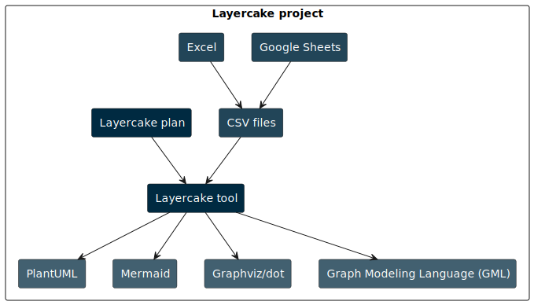
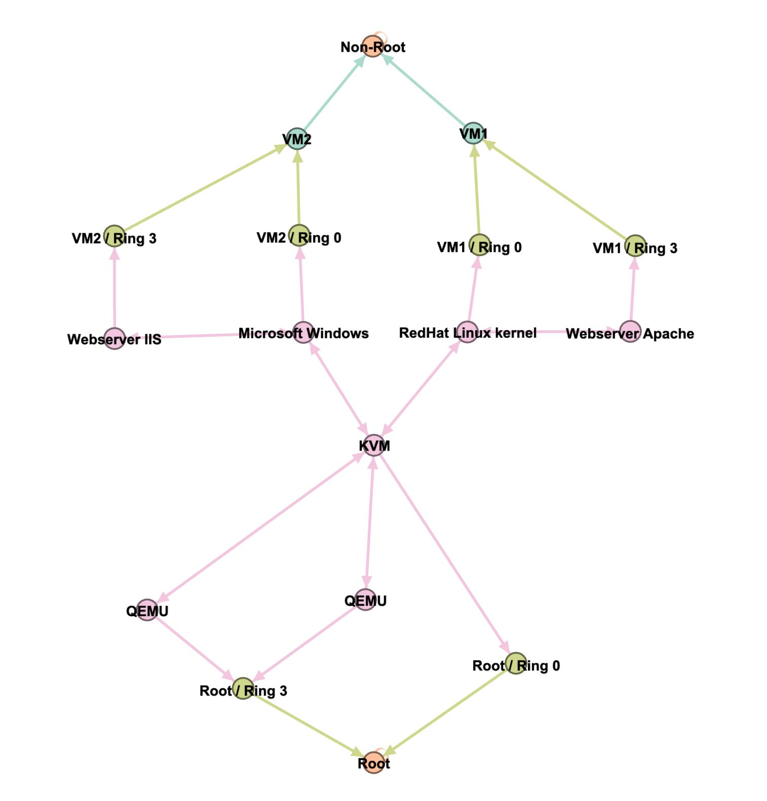
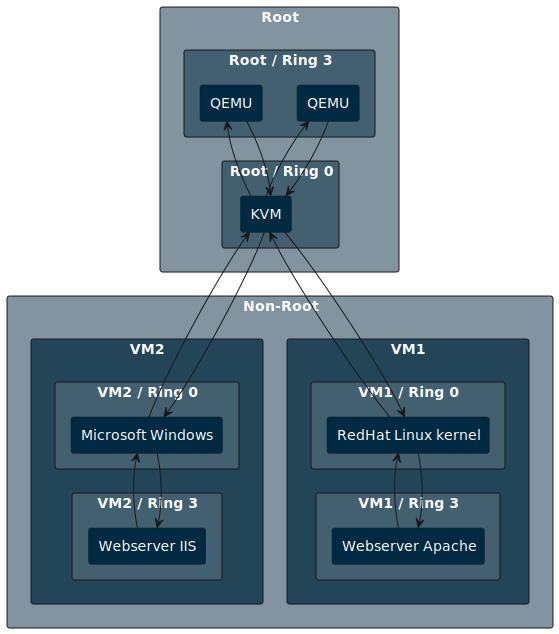
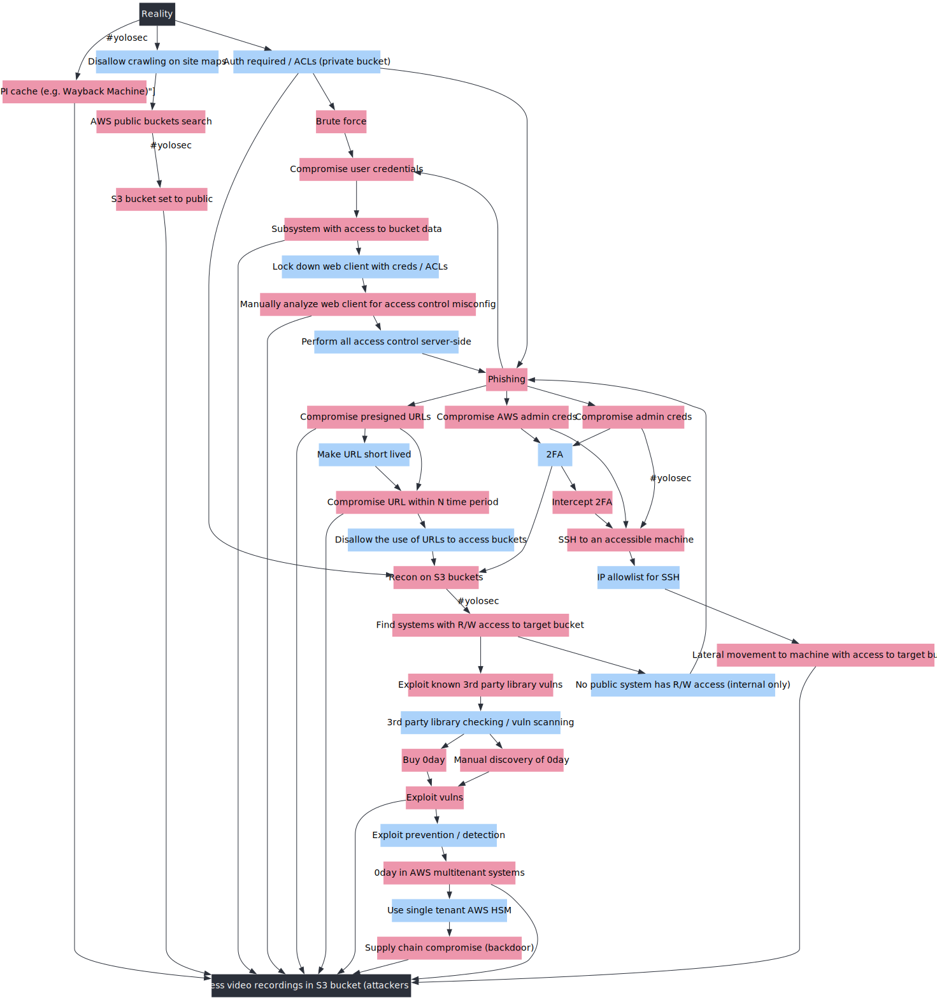
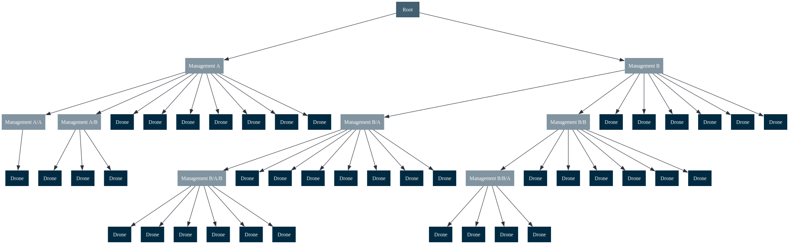
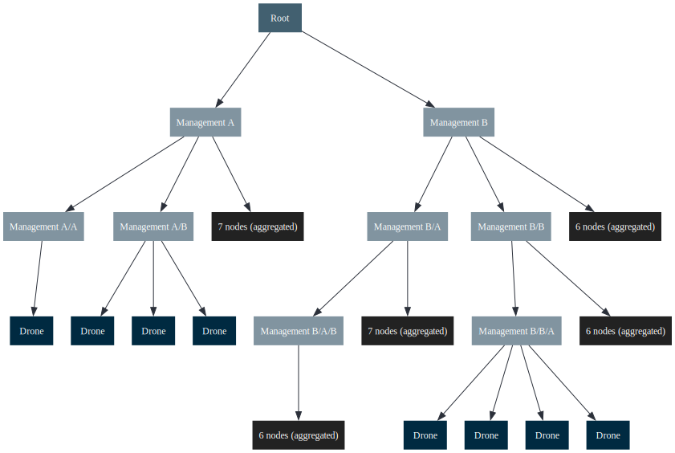
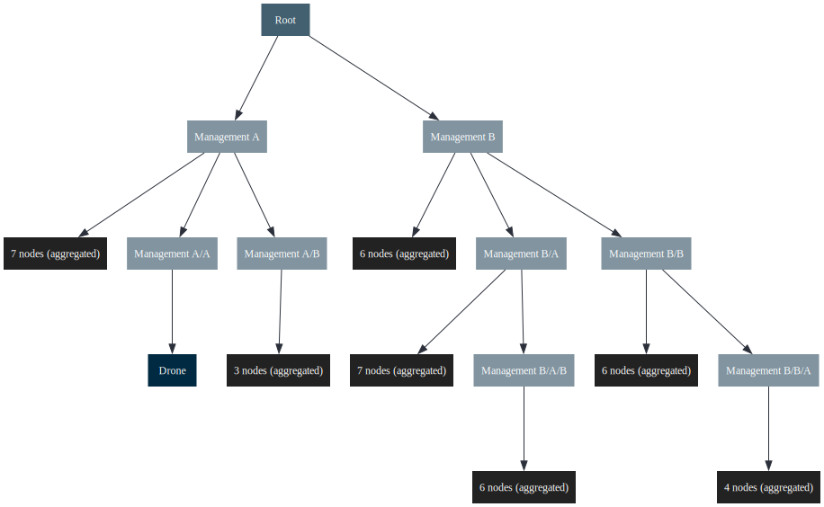

# Layercake tool

This tool takes graph definitions in CSV/TSV format and generates various graph formats for rendering.
Export to,

 - PlantUML
 - Graphviz / dot
 - Mermaid
 - GML (Graph Modeling Language)

Custom renders can be added using [Handlebars](https://handlebarsjs.com/) templates via [handlebars-rust](https://docs.rs/handlebars/latest/handlebars/).



_Project data flow, defined using this project. The data is available in the `sample` directory._

## Installation

Download a release from the [releases page](https://github.com/michiel/layercake-tool/releases).

### MacOS

Remove the quarantine attribute from the binary,
```
xattr -d com.apple.quarantine ./layercake
```

## Concepts

Nodes come in two types, partition and non-partition nodes. Partition nodes are used to group nodes together, and are used to create a hierarchy in the graph.

## Usage

See also [the tips and snippets](README-Tips.md) for file watchers, command line rendering, etc

### Example

Using the sample project,


```bash
# Generate a sample project
layercake generate sample attack_tree example-project

# Run the sample project with a plan, this will generate the output files
layercake run -p example-project/plan.yaml 

# Run the sample project with a plan, re-run the plan on input changes
layercake run -p example-project/plan.yaml -w
```

Now edit and change the CSV files. A collaborative workflow might include Google Sheets, with separate sheets for nodes and edges, followed by export to CSV. If you make local changes, re-import the changed CSV files back to the source.

If you want to re-run the plan on input changes, you can use the `-w` (**watch**) flag. This will re-run the plan when any of the input files change. If you want to automatically generate images 
from the output files, you can use a file watcher.


## Development

### Sample run

```
cargo run -- -p sample/kvm_control_flow_plan.yaml
```

## Rendered examples

_This tool only outputs text files, the following images are rendered using other tools._

### GML rendered with Gephi
Sample control for for virtualized x86 architecture, output to GML and rendered using Gephi.



### PlantUML rendered
Sample control for for virtualized x86 architecture, output rendered using [PlantUML](https://plantuml.com/).



### Graphviz rendered
Sample attack tree from [Kelly Shortridge's Security Descision Trees with Graphviz](https://kellyshortridge.com/blog/posts/security-decision-trees-with-graphviz/) output rendered using [Graphviz](https://graphviz.org/)



## Graph transformations

### Partition width

Aggregate the nodes in a partition of the limit exceeds the set parameter (`partition_width`).


_Reference model with no transformation_


_Reference model with a partition width of 5_


_Reference model with a partition width of 2_


