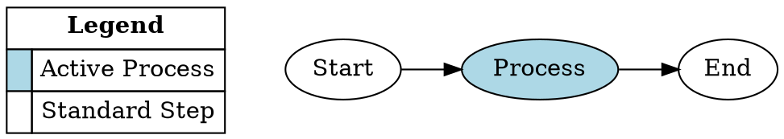
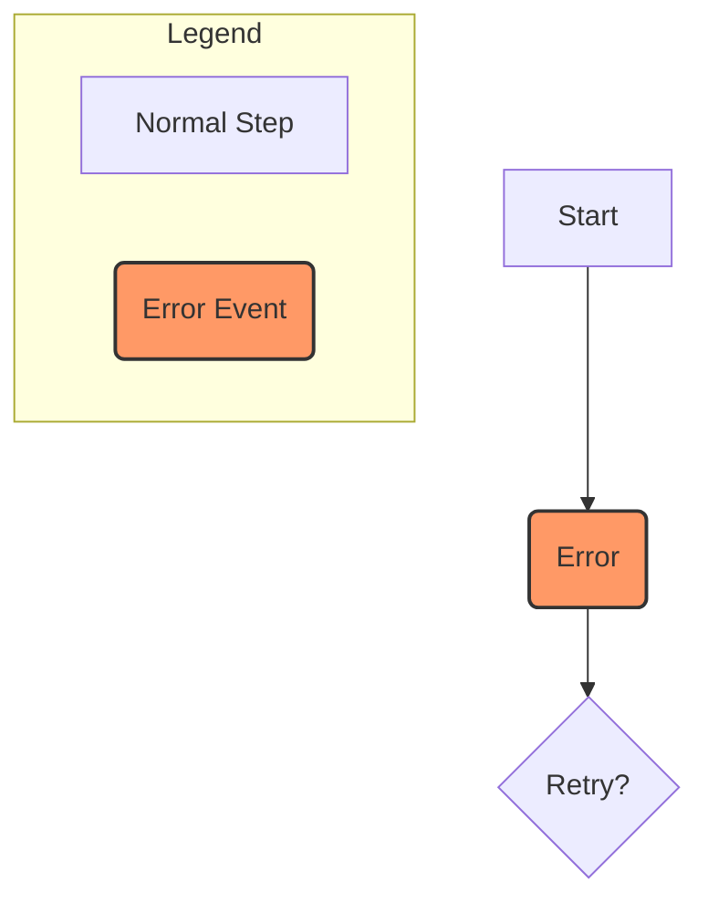
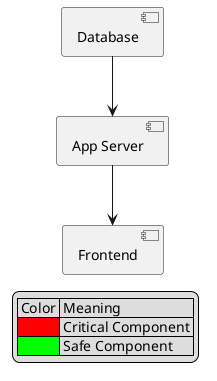

Adding a legend to text-based diagrams often requires different strategies depending on the tool, as some support it natively while others require "workarounds" (creating specific nodes or subgraphs).

Here are your options for Graphviz, Mermaid, and PlantUML.

-----

### 1\. Graphviz (DOT)

**Status:** **No native tag**, but highly customizable via **HTML-like labels**.

Graphviz does not have a specific `legend` command. The standard best practice is to create a separate node with `shape=plaintext` and use an HTML-like label to build a table that acts as the legend.

**The Strategy:**

1.  Create a node (e.g., named `key`).
2.  Set `shape=plain` or `plaintext`.
3.  Use HTML tables to format color keys or symbols.
4.  (Optional) Place it inside a `subgraph cluster` or use `rank=source` to force it to the top.

**Example Code:**

-----

### 2\. Mermaid (Flowchart)

**Status:** **No native tag**. Requires a **Subgraph Hack**.

Mermaid flowcharts are restrictive regarding absolute positioning. You cannot easily "pin" a legend to a corner. The best option is to create a dedicated subgraph that acts as a visual key.

**The Strategy:**

1.  Create a `subgraph` named "Legend".
2.  Add nodes inside meant to represent your keys.
3.  Use `classDef` to style the legend nodes to match your actual diagram nodes.
4.  *Note:* The legend will flow with the diagram logic (usually ending up at the top or bottom depending on layout).

**Example Code:**

> **Pro Tip:** In Mermaid, if you want the legend to appear completely separate, you may need to render two separate diagrams on your page (one for the chart, one for the legend) rather than trying to force them into one code block.

-----

### 3\. PlantUML (Component Diagram)

**Status:** **Native Support**. Best in class.

PlantUML has a dedicated `legend` keyword. You can control the position and the content easily without hacking the graph nodes.

**The Strategy:**

1.  Use the `legend` block.
2.  Specify position (`top`, `bottom`, `left`, `right`, `center`).
3.  Use Creole syntax (PlantUML's markdown) inside the legend for formatting.

**Example Code:**

-----

### Summary Comparison

| Feature | Graphviz | Mermaid | PlantUML |
| :--- | :--- | :--- | :--- |
| **Native Tag** | No | No | **Yes** |
| **Positioning** | High (via Rank/Structs) | Low (Auto-layout) | **High** (Top/Bottom/Left/Right) |
| **Complexity** | High (Requires HTML) | Medium (Requires Subgraphs) | **Low** (Simple block) |

### Would you like me to write the specific code for a legend based on one of your existing diagrams?
