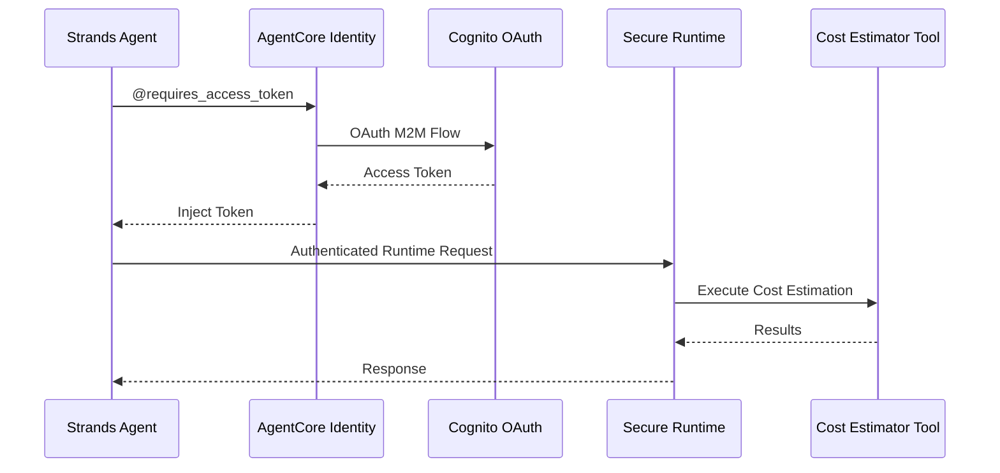

# AgentCore Identity統合

[English](README.md) / [日本語](README_ja.md)

この実装では、セキュアなランタイム呼び出しのためのOAuth 2.0認証を使用した**AgentCore Identity**を実演します。`@requires_access_token`デコレータは、認証されたエージェント操作のための透明なトークン管理を提供します。

## プロセス概要



## 前提条件

1. **ランタイムデプロイ済み** - まず`02_runtime`セットアップを完了
2. **AWS認証情報** - `bedrock-agentcore-control`権限付き
3. **依存関係** - `uv`経由でインストール（pyproject.toml参照）

## 使用方法

### ファイル構成

```
03_identity/
├── README.md                      # このドキュメント
├── setup_inbound_authorizer.py    # OAuth2プロバイダーとセキュアランタイムセットアップ
└── test_identity_agent.py         # Identity認証付きテストエージェント
```

### ステップ1: OAuth2認証情報プロバイダーとセキュアランタイムを作成

```bash
cd 03_identity
uv run python setup_inbound_authorizer.py
```

このスクリプトは以下を実行します：
- M2Mクライアント認証情報を使用したCognito OAuthオーソライザーの作成
- AgentCore Identity OAuth2認証情報プロバイダーのセットアップ
- JWT認証付きセキュアランタイムのデプロイ
- `inbound_authorizer.json`での設定生成

### ステップ2: Identity保護エージェントをテスト

```bash
cd 03_identity
uv run python test_identity_agent.py
```

これにより、トークン取得とセキュアランタイム呼び出しを含む完全な認証フローがテストされます。

## 主要な実装パターン

### @requires_access_token による access token の取得

```python
from strands import tool
from bedrock_agentcore.identity.auth import requires_access_token

@requires_access_token(
    provider_name=OAUTH_PROVIDER,
    scopes=[OAUTH_SCOPE],
    auth_flow="M2M",
    force_authentication=False
)
async def _cost_estimator_with_auth(architecture_description: str, access_token: str = None) -> str:
    """Internal function that handles the actual API call with authentication"""
    session_id = f"runtime-with-identity-{datetime.now(timezone.utc).strftime('%Y%m%dT%H%M%S%fZ')}"

    if access_token:
        logger.info("✅ Successfully load the access token from AgentCore Identity!")
        # Parse and log JWT token parts for debugging
        log_jwt_token_details(access_token)

    headers = {
        "Authorization": f"Bearer {access_token}",
        "Content-Type": "application/json",
        "X-Amzn-Bedrock-AgentCore-Runtime-Session-Id": session_id,
        "X-Amzn-Trace-Id": session_id,
    }

    response = requests.post(
        RUNTIME_URL,
        headers=headers,
        data=json.dumps({"prompt": architecture_description})
    )

    response.raise_for_status()
    return response.text


@tool(
    name="cost_estimator_tool",
    description="Estimate cost of AWS from architecture description"
)
async def cost_estimator_tool(architecture_description: str) -> str:
    # access_token は @requires_access_token デコレーターにより自動挿入
    # 内部関数を呼び出す形式にすることで、Agent から access token の引数の存在を隠している
    return await _cost_estimator_with_auth(architecture_description)
```

### エージェント統合パターン

```python
from strands import Agent

agent = Agent(
    system_prompt="あなたはプロフェッショナルなソリューションアーキテクトです...",
    tools=[cost_estimator_tool]
)

# エージェントは自動的にトークンの取得と注入を処理します
await agent.invoke_async("アーキテクチャの説明をここに...")
```

## 使用例

```python
import asyncio
from strands import Agent
from test_identity_agent import cost_estimator_tool

agent = Agent(
    system_prompt=(
        "あなたはプロフェッショナルなソリューションアーキテクトです。"
        "お客様からアーキテクチャの説明や要件を受け取ります。"
        "'cost_estimator_tool'を使用して見積もりを提供してください"
    ),
    tools=[cost_estimator_tool]
)

# アーキテクチャ記述でのテスト
architecture = """
シンプルなWebアプリケーション：
- Application Load Balancer
- 2x EC2 t3.mediumインスタンス
- us-east-1のRDS MySQLデータベース
"""

result = await agent.invoke_async(architecture)
print(result)
```

## セキュリティの利点

- **トークンの露出ゼロ** - トークンがログやコードに表示されることはありません
- **自動ライフサイクル管理** - AgentCoreが有効期限を処理します
- **ランタイムレベルのセキュリティ** - ランタイムレベルでのJWT認証
- **M2M認証** - 自動化システムに適しています

## 参考資料

- [AgentCore Identity開発者ガイド](https://docs.aws.amazon.com/bedrock-agentcore/latest/devguide/identity.html)
- [OAuth 2.0 Client Credentials Flow](https://tools.ietf.org/html/rfc6749#section-4.4)
- [Cognito OAuth統合](https://docs.aws.amazon.com/cognito/latest/developerguide/cognito-user-pools-app-integration.html)
- [Strands Agentsドキュメント](https://github.com/aws-samples/strands-agents)

---

**次のステップ**: ここで実演されたパターンを使用して、Identity保護エージェントをアプリケーションに統合するか、[04_gateway](../04_gateway/README.md)に進んでMCP互換APIを通じてエージェントを公開しましょう。
