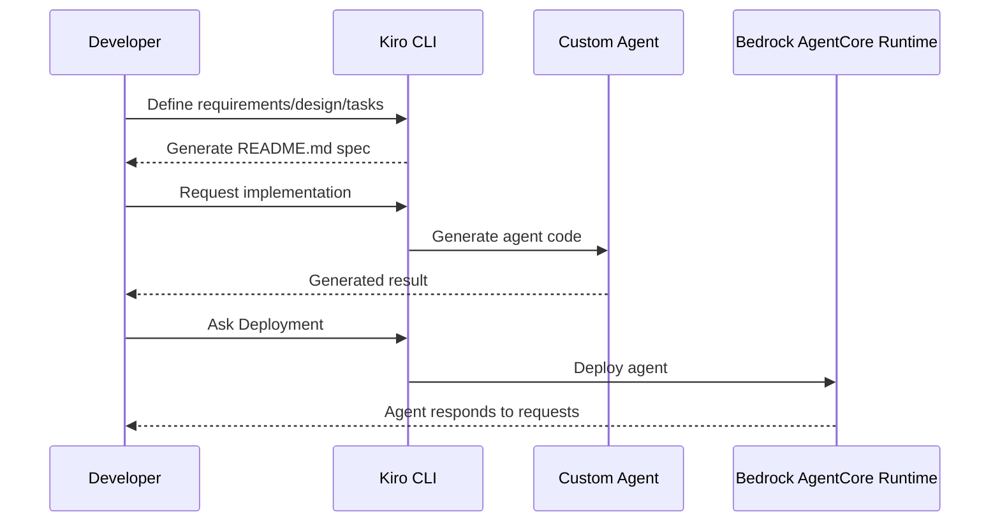

# Lab A-1: Custom Agent Development with Kiro

[English](README.md) / [日本語](README_ja.md)

This lab demonstrates how to develop and deploy a custom agent to **Amazon Bedrock AgentCore** using the [Kiro](https://kiro.dev/) AI coding agent tool. You will leverage Spec Driven Development to define requirements, design, and implementation tasks, and use [Kiro CLI](https://kiro.dev/cli/) for agent creation and deployment.

## Process Overview



## Prerequisites

1. **Kiro CLI** - Installed and authenticated with AWS Builder ID

## How to use

### File Structure

```
a1_custom/
├── README.md                # This documentation
├── .kiro/                   # Kiro agent definitions
│   ├── agents/              # Agent definition
│   └── steering/            # Agent control files
├── agent_name/              # Your custom agent files
└── ... 
```

### Step 1: Environment Setup

Move to the custom agent directory and start Kiro CLI:

```bash
cd a1_custom
kiro-cli --agent agent-builder
```

### Step 2: Write Spec (Requirements/Design/Tasks)

Define your agent's requirements, design, and implementation tasks in `README.md` using Kiro CLI. For example, to create a weather forecast agent:

```
An agent that returns weather forecasts in response to user questions
```

Review and revise the generated spec as needed.

### Step 3: Implement the Agent

Once the spec is ready, instruct Kiro CLI to implement according to `README.md`:

```
Implement agent by following README.md 
```

Kiro will generate the agent code in your directory.

### Step 4: Deploy and Test

Deploy your agent using AgentCore CLI (similar to Lab 2):

```bash
uv run agentcore launch --local-build
```

Test your agent:

```bash
uv run agentcore invoke '{"prompt": "What's the weather in New York?"}'
```

If errors occur, copy the error message to Kiro CLI for troubleshooting.

## Key Learnings

- **Rapid prototyping** - Kiro streamlines agent development from spec to deployment
- **Spec documentation** - Ensures requirements and design are reviewed before implementation
- **AI-powered coding** - Offloads implementation to AI coding agents
- **Error recovery** - Easy troubleshooting via Kiro CLI

## References

- [Kiro CLI Documentation](https://kiro.dev/cli/)
- [Amazon Q Developer Extension](https://docs.aws.amazon.com/amazonq/latest/qdeveloper-ug/q-in-IDE-setup.html)
- [AgentCore Runtime Developer Guide](https://docs.aws.amazon.com/bedrock-agentcore/latest/devguide/runtime.html)
- [Bedrock AgentCore Starter Toolkit](https://github.com/aws/bedrock-agentcore-starter-toolkit)

---

**Next Steps**: Explore advanced AgentCore features such as Identity, Gateway, and Memory to build more sophisticated AI agents.
