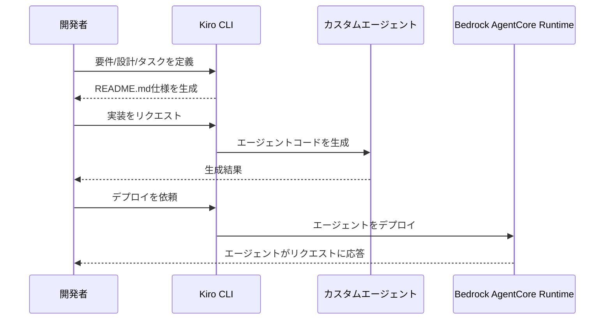

# Lab A-1: Kiroを使用したカスタムエージェント開発

[English](README.md) / [日本語](README_ja.md)

この実装では、学んだ内容を活かし独自のカスタムエージェントを開発し **Amazon Bedrock AgentCore** へデプロイします。もちろんゼロから書く必要はなく、ワークショップのコードと AI コーディングエージェントツールである[Kiro](https://kiro.dev/) を活用します。[Kiro CLI](https://kiro.dev/cli/)を使用し Spec Driven なエージェントの作成とデプロイを行います。

## プロセス概要



## 前提条件

1. **Kiro CLI** - AWS Builder IDで認証済み

## 使用方法

### ファイル構成

```
a1_custom/
├── README.md                # このドキュメント
├── .kiro/                   # Kiroエージェント定義
│   ├── agents/              # エージェント定義
│   └── steering/            # エージェント制御ファイル
├── agent_name/              # カスタムエージェントファイル
└── ... 
```

### ステップ1: 環境セットアップ

カスタムエージェントディレクトリに移動し、Kiro CLIを起動します：

```bash
cd a1_custom
kiro-cli --agent agent-builder
```

### ステップ2: 仕様を記述（要件/設計/タスク）

Kiro CLIを使用して、`README.md`にエージェントの要件、設計、実装タスクを定義します。例えば、天気予報エージェントを作成する場合：

```
ユーザーの質問に対して天気予報を返すエージェント
```

生成された仕様を確認し、必要に応じて修正します。

### ステップ3: エージェントを実装

仕様の準備ができたら、Kiro CLIに`README.md`に従って実装するよう指示します：

```
README.mdに従ってエージェントを実装してください
```

Kiroがディレクトリにエージェントコードを生成します。

### ステップ4: デプロイとテスト

AgentCore CLIを使用してエージェントをデプロイします（Lab 2と同様）：

```bash
uv run agentcore launch --local-build
```

エージェントをテストします：

```bash
uv run agentcore invoke '{"prompt": "東京の天気は？"}'
```

エラーが発生した場合は、エラーメッセージをKiro CLIにコピーしてトラブルシューティングを行います。

## 主要な実装パターン

- **迅速なプロトタイピング** - Kiroは仕様からデプロイまでのエージェント開発を効率化
- **仕様ドキュメント** - 実装前に要件と設計を確実にレビュー
- **AI駆動のコーディング** - 実装をAIコーディングエージェントにオフロード
- **エラー回復** - Kiro CLIを介した簡単なトラブルシューティング

## 参考資料

- [Kiro CLIドキュメント](https://kiro.dev/cli/)
- [Amazon Q Developer拡張機能](https://docs.aws.amazon.com/amazonq/latest/qdeveloper-ug/q-in-IDE-setup.html)
- [AgentCore Runtime開発者ガイド](https://docs.aws.amazon.com/bedrock-agentcore/latest/devguide/runtime.html)
- [Bedrock AgentCore Starter Toolkit](https://github.com/aws/bedrock-agentcore-starter-toolkit)

---

**次のステップ**: Identity、Gateway、Memoryなどの高度なAgentCore機能を探索して、より洗練されたAIエージェントを構築しましょう。
